# How to Use LoadFAST

## 1. Introduction

Welcome to LoadFAST, this guide will help you understand the features and functionalities of the application and provide step-by-step instructions for efficient use.

### Purpose

LoadFAST is a load testing tool for Power BI reports that uses virtual users to measure and analyze page load time. It automates performance testing across multiple reports with concurrent load simulation, detailed performance insights.

### Key Features

1. **Create Collection:** Group multiple reports, add collaborators, apply RLS configurations, user actions, and perform test runs.
2. **Create Test Run:** Run load or stress tests with customizable load count at the report level.
3. **Admin Settings:** Accessible to admins for managing cluster states, load count, and report configurations.
4. **Insight Report:** Analyze detailed performance metrics for collections, reports, pages, and visuals.
5. **Capacity Report:** Analyze capacity usage and optimization metrics.
6. **Evaluate Impact on Fabric Capacity:** Assess how reports affect the utilization of Fabric resources.
7. **Optimize Fabric Capacity:** Maximize efficiency of Fabric usage.
8. **Analyze Report Performance:** Review report load times and interactions.
9. **Identify Expensive Reports and Visuals:** Analyze reports and visuals with high load time.
10. **Manage Fabric Capacity Utilization:** Identify the ideal capacity setup across multiple reports, ensuring no under- or over- provisioning.
             
### System Requirements
- Compatible browsers: Chrome, Firefox, Edge, Safari
- Internet connection required

## 2. Getting Started

### Accessing the Application

**Steps:**

 - Open the LoadFAST web URL in your browser.
 - Choose your account and complete authentication to access the tool.

   <figure>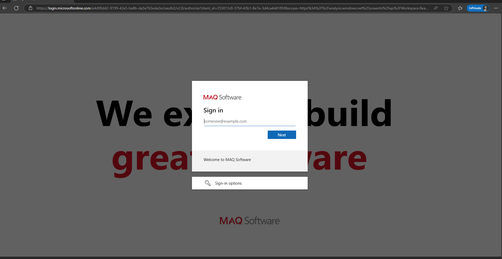<figcaption></figcaption></figure>

## 3. Navigation and Interface

### Side Panel
The side panel consists of the following options:

- **Home:** Access collections and Manage collection.
- **All Tests:** View all test runs across collections in a single location.
- **Admin Settings:** Manage cluster state, load count and report configuration.
- **Insight Report:** Access detailed insights of collections.
- **Capacity Report:** Analyze capacity usage and optimization metrics.

<figure>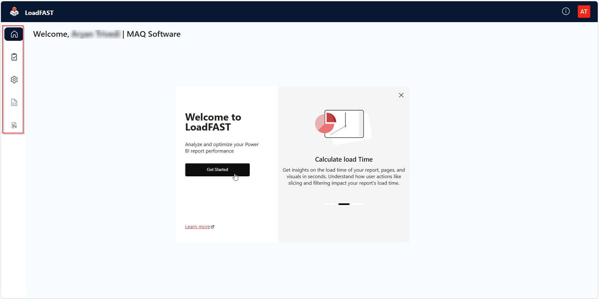<figcaption></figcaption></figure>
  
### Header
It consists of the following options:

- **Info icon (i) button:** Redirects user to tool setup documentation.
- **User Settings:** Allows user to view account information and log out.

<figure>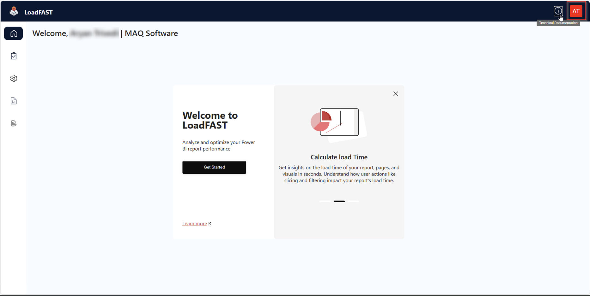<figcaption></figcaption></figure>
  
### Main Content Area
After clicking **Get Started**, the user will be directed to the main content area that serves as the central hub for LoadFAST.

- **All Collections:** View all available collections.
- **My Collections:** Access collections created by the user.
- **Shared with Me:** Access collections shared with the user for collaboration or review.
- **Favorites:** Quickly access the user's favorite collections.
- **Search bar:** Use for finding a specific collection.
- **Filter:** Use for filtering collections (e.g., sort by Name, Report Count, time)

<figure>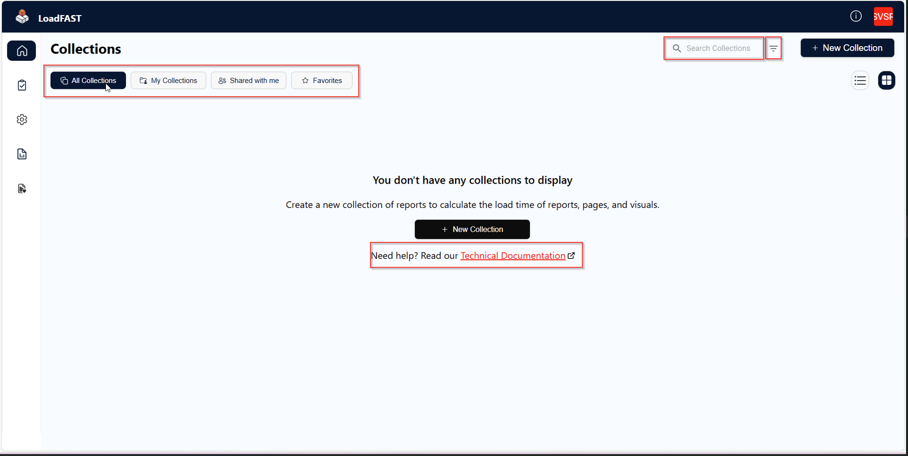<figcaption></figcaption></figure>

## 4. Key Features & How to Use Them

### Create Collection
Creating a collection in LoadFAST allows users to group reports and pages for analysis and testing.

**Steps:**

1. **Click on + New Collection:**
   - On the Collections page, click the **+ New Collection** button to start creating a new collection.

   <figure>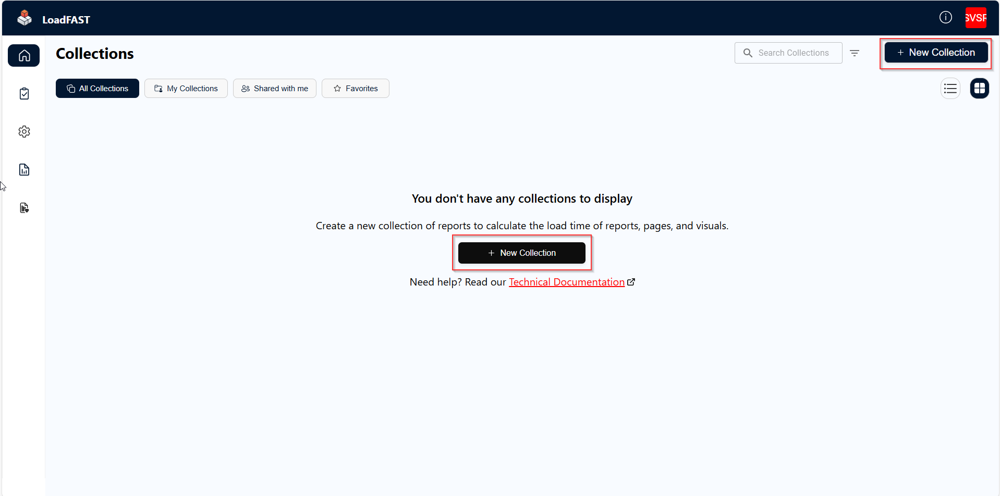<figcaption></figcaption></figure>

2. **Enter Collection Details:**
   - Provide a name for your collection in the **Collection Name** field.
   - Add collaborators by clicking **+ New Collaborator** and entering their **email** addresses. 
   - Assign roles (Editor, Viewer) using the dropdown next to their names:
     - **Editor:** Has permission to edit the collection, add collaborators, create test runs, add/remove report, and change the collection name.
     - **Viewer:** Has permission to view the collection and see test runs inside the collection.
   - After entering the collection details, click **Continue** to proceed to the next step.
  
      **Note:** The **Continue** button will remain disabled until a valid collaborator email address is provided.
   

   <figure>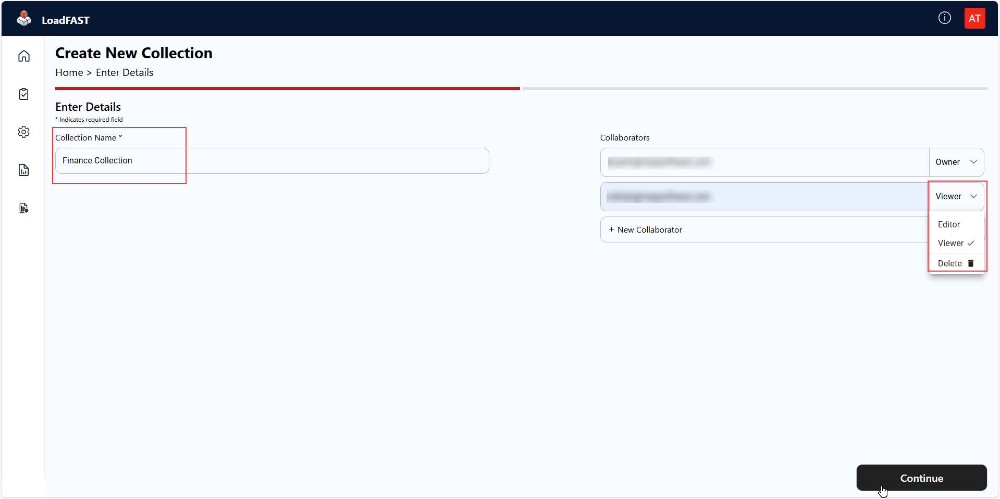<figcaption></figcaption></figure>

3. **Select Reports and Pages:**

   - Browse through the available workspaces and reports.
   - Use filters or the search bar to find specific reports.
   - Select the reports and pages you want to include by **checking the boxes** next to them.
   - RLS report is indicated with an icon.
   
   <figure>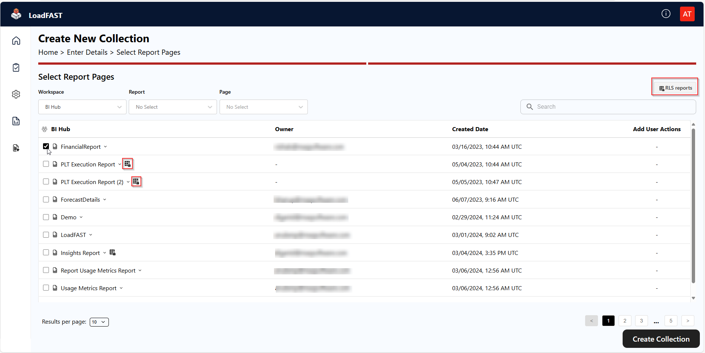<figcaption></figcaption></figure>

4. **Configure RLS (If RLS report is selected)**
   **Steps:**
   - Click on **Configure RLS** button.
   

    <figure>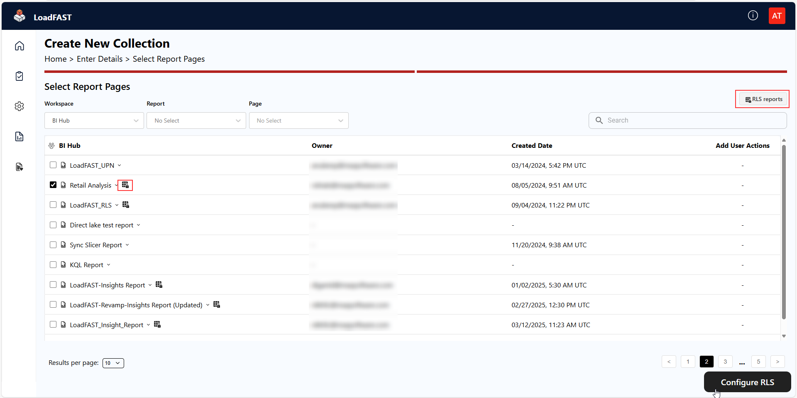<figcaption></figcaption></figure>
   
   - Select **Role Name** from Dropdown box
   - Enter the **Email** address.
    
     **Note:** *If you are an Admin, you can test on behalf of any user else your own email will be selected by default.*

      
      <figure>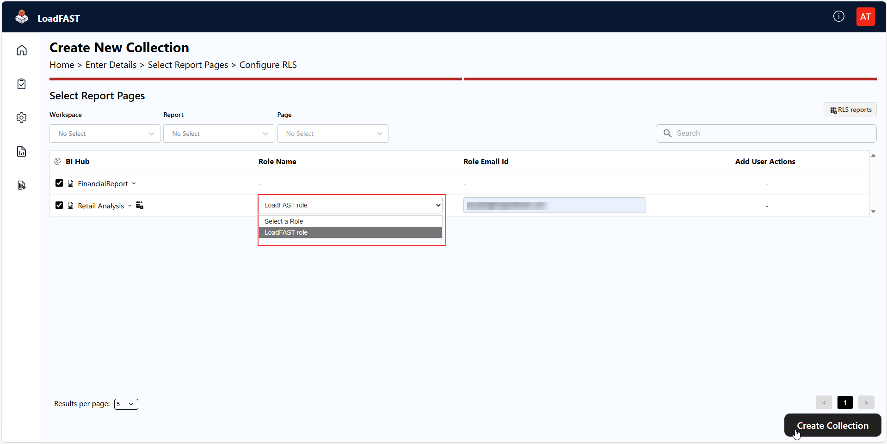<figcaption></figcaption></figure>

5. **Add User Action:**
  While selecting a report, users can add simple actions like filtering or slicing. These actions are used to calculate the Page Load Time (PLT) based on the selected interactions, providing more accurate performance metrics.

   **Steps:**
   - Click on the dropdown arrow next to the report name, then you will see **+** in user action for each page.
   - Click on the **+** icon to apply user action.
      
      <figure>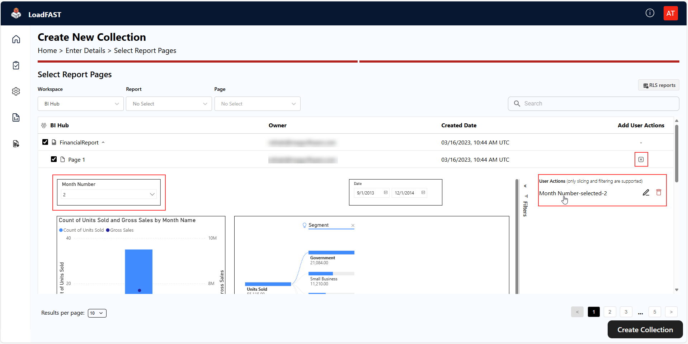<figcaption></figcaption></figure>
   
   - For **RLS Report** User Action will be available after RLS configuration.
      - After filling **Role Name** and **Role Email ID**.
      - Click on the dropdown arrow next to the report name, then you will see **+** in the add user action column for each page.
      - Click on the **+** icon to apply user action.
      
        <figure>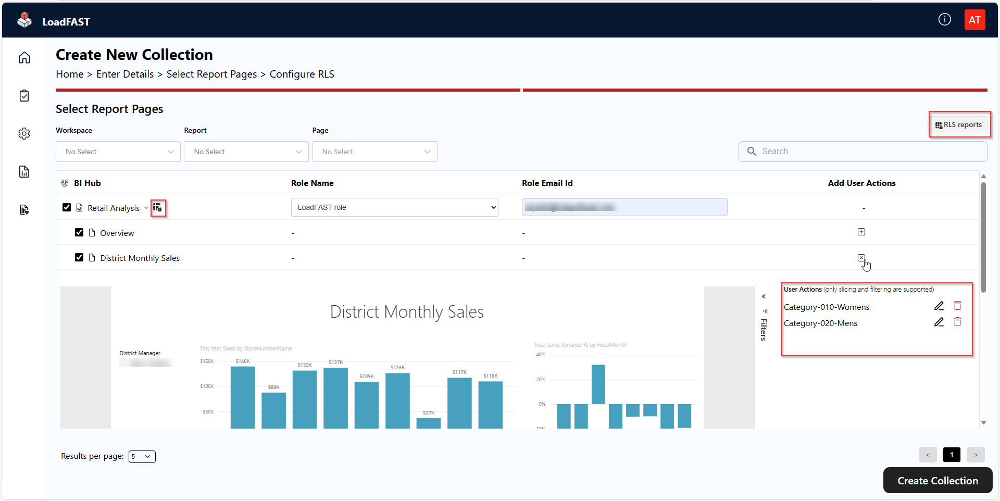<figcaption></figcaption></figure>

1. **Review and Finalize:**
   - Ensure all desired reports/pages are selected.
   - Click **Create Collection** to create your collection.
   
     <figure>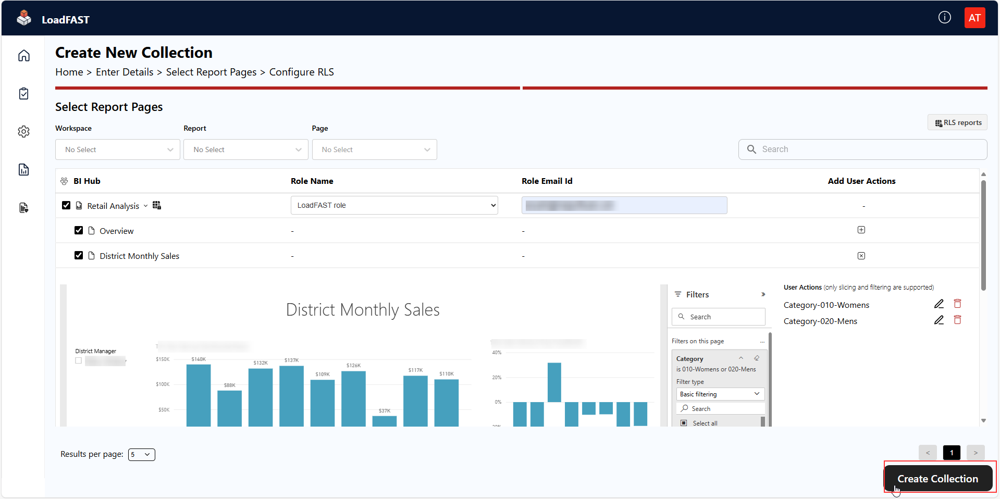<figcaption></figcaption></figure>

**Additional Functionalities:**

- **Edit Collection:**
   - Collections can be edited, user can change collection name, add or remove reports/pages or update collaborators.
   

     **Note:** Report can be updated only when no Test Run is Created/Triggered inside the collection.
   
   
   <figure>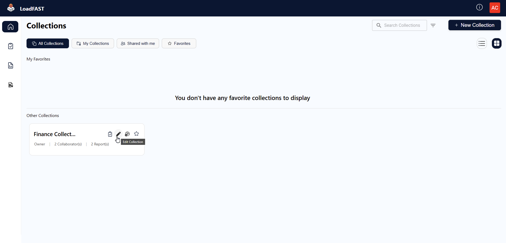<figcaption></figcaption></figure>

- **Table View:**

   - User can switch to Table View for a tabular representation of data, making it easier to view.
   - Here, users can sort data based on various attributes such as **Name**, **Access**, and **Created Date** for quick access.
   

     <figure>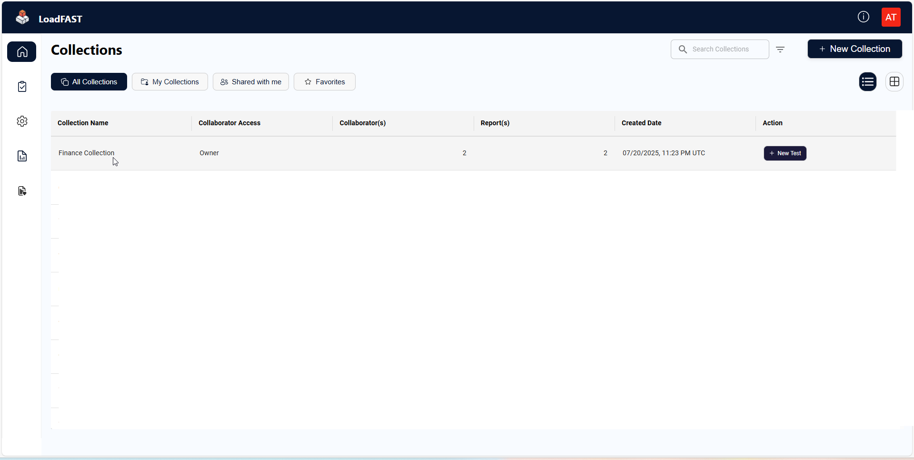<figcaption></figcaption></figure> 
 

### Create Test Run
Creating a test run in LoadFAST allows you to simulate user activity and measure the performance of your reports by specifying the load count. This helps in identifying bottlenecks and optimizing report load times.

**Steps:**

1. **Enter Collection’s Detail Page**

    - Click on created collection to enter detail page.
    
      <figure>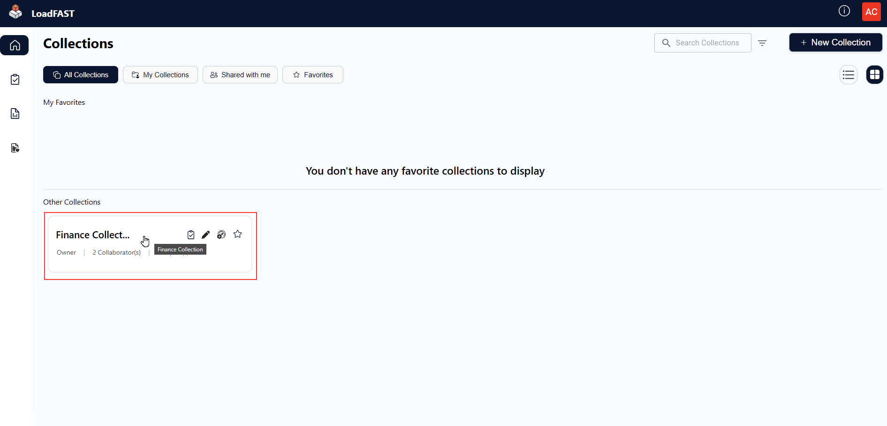<figcaption></figcaption></figure>

1. **Click on + New Test:**
    - On your collection’s detail page, click the **+ New Test** button to start creating a new test run.
  
      <figure>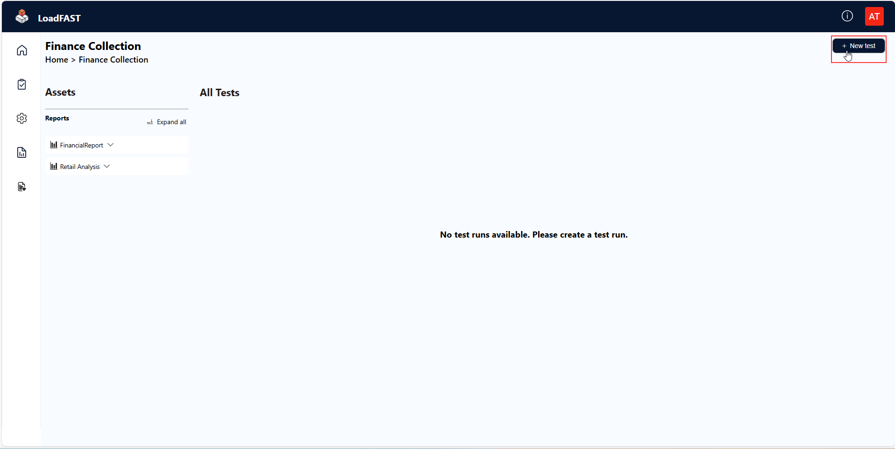<figcaption></figcaption></figure>

1. **Select Load Test:** Enter the desired user count. 

     <figure>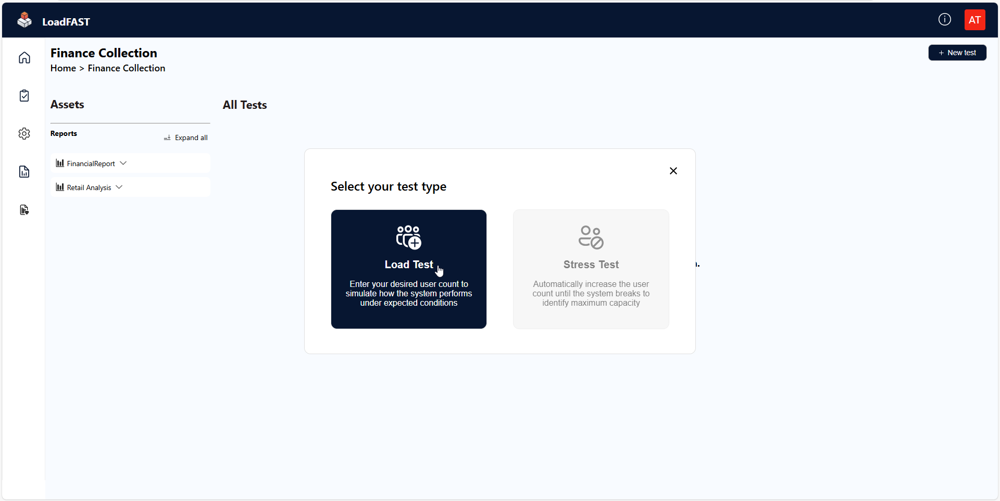<figcaption></figcaption></figure>

2. **Enter Test Details:**

   - Provide a name for your test in the **Test Name** field.
   - Configure the number of users (load count) to simulate for the test run.
   - Use options "Apply to All" or "Percentage Split" to distribute users across assets.
     - **Apply to All:** Equally distribute user count to all reports
        **Example:** If you enter 5 users, each page of every report will receive 5 users. For instance:
         - "FinancialReport" has 2 pages, so it will receive 2 × 5 = 10 users.
         - "Retail Analysis" has 4 pages, so it will receive 4 × 5 = 20 users.
         - The total load count will be calculated as 10 + 20 = 30 users.
         
         <figure>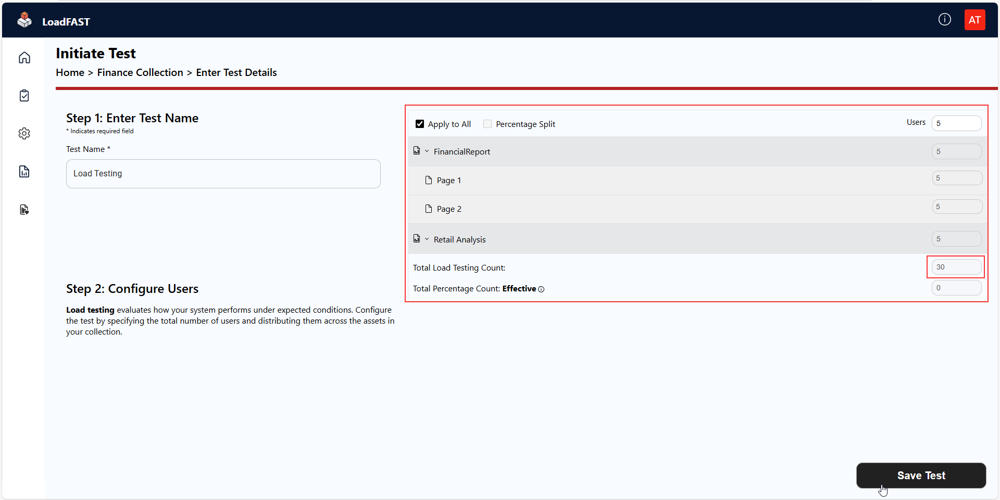<figcaption></figcaption></figure>
     
     - **Percentage Split:** Customizable distribute user count to all reports
     **Example:** If you enter 10 users and allocate percentages as follows:
         - "FinancialReport" is assigned 20%, so it will receive 10 × 20% = 2 users.
         - "Retail Analysis" is assigned 80%, so it will receive 10 × 80% = 8 users.
         - The total load count will be distributed as per the specified percentages.
         
         **Note:** Ensure the "Total Percentage Count: Effective" is 100.
         
         
         <figure>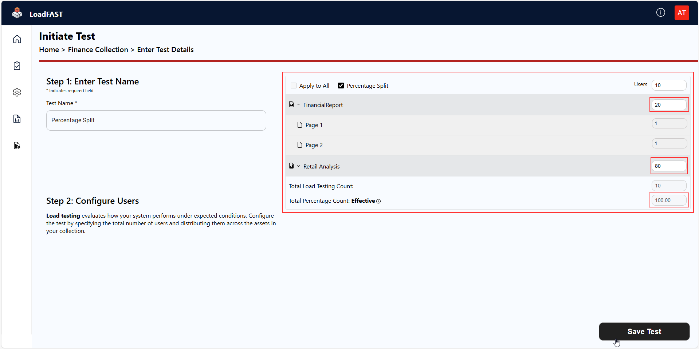<figcaption></figcaption></figure>
   
   - After entering the test details, click **Save Test** to proceed.
   
     <figure>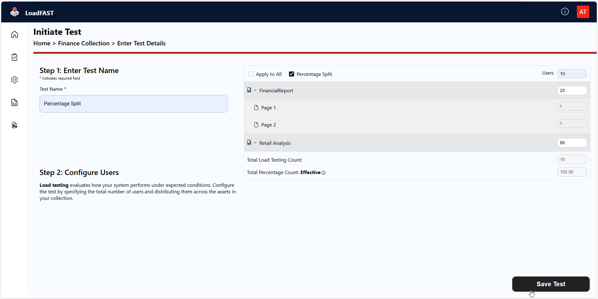<figcaption></figcaption></figure>

3. **Review and Trigger Test Run:**

   - Your test run will appear within the collection.
   - Click the **Trigger** button to initiate the test run.
      - It will calculate the Average Page Load Time (Avg PLT) and the 90th percentile, updating the Run Status based on the specified Load Count.
      
      <figure>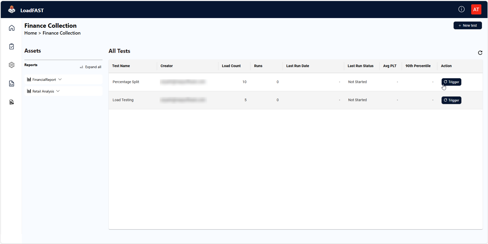<figcaption></figcaption></figure>

4. **Monitor Test Progress and Results:**

   - Metrics such as average PLT, 90th Percentile, and run status will be displayed for each test run:
     - **Run Status:** Indicates the current state of the test run (e.g., Not Started, In Progress, Partially Passed, Completed, Failed).
       - **Partially Passed:** Indicates that some pages in the report passed the test, while others failed.
       - **Failed:** Indicates that there is an issue with the report. Hovering over the "Failed" status of a particular run displays a pop-up box with details about the issue.
     - **Average PLT (Page Load Time):** Shows the average time taken for report pages to load during the test run.
     - **90th Percentile:** Represents the page load time below which 90% of the test results fall. This helps identify outliers and gives a realistic view of user experience.
   - Click on the **+** icon to the left of the created test run name to expand and view all the triggered runs for that Test Run, including their individual statuses and metrics.
   
     <figure>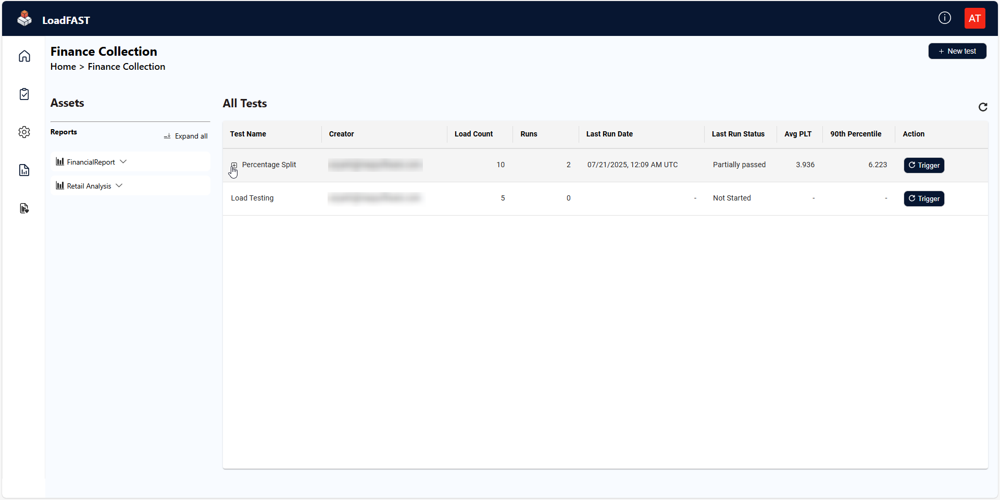<figcaption></figcaption></figure>
   
   - It displays the executed result of each run.
   
     <figure>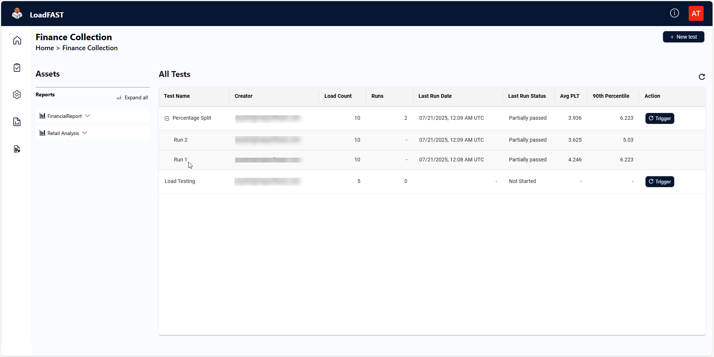<figcaption></figcaption></figure>

### All Tests
The All Tests page allows users to view all test runs created across different collections in a single location. Users can also search for specific tests using the dropdown box.

**Steps:**

1. Click on the **All Tests** icon from the sidebar.

     <figure>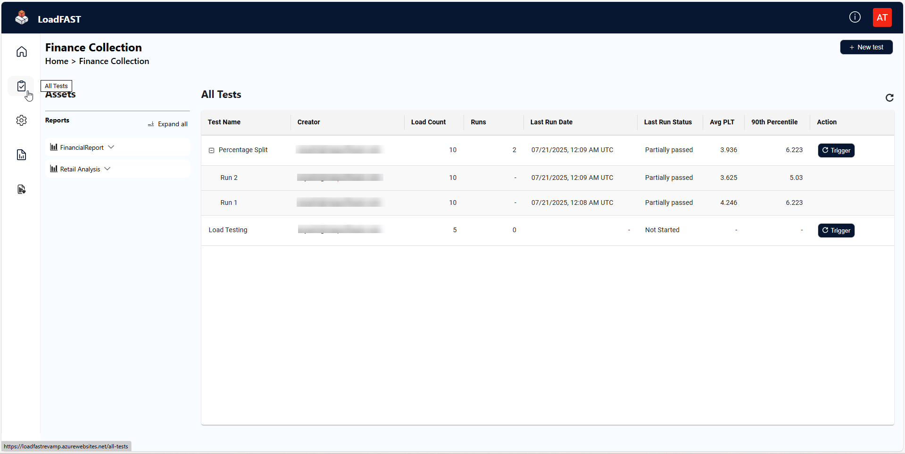<figcaption></figcaption></figure>

2. **Select Collection:** By default, all tests from all collections are shown.
   
     <figure>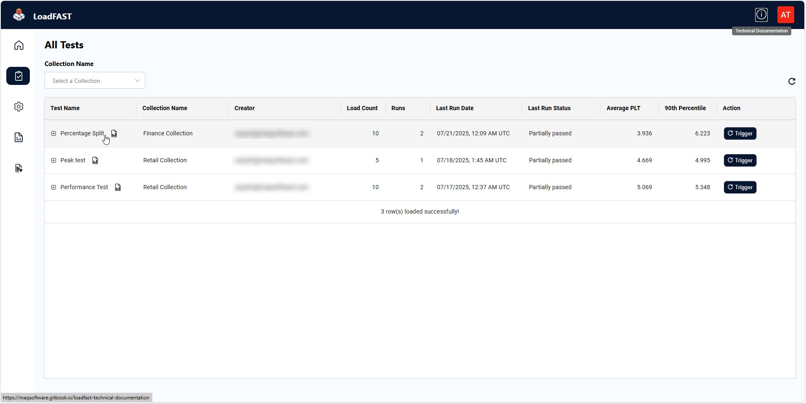<figcaption></figcaption></figure>
   
   - Select a collection from the dropdown to view test runs specific to that collection.
   
     <figure>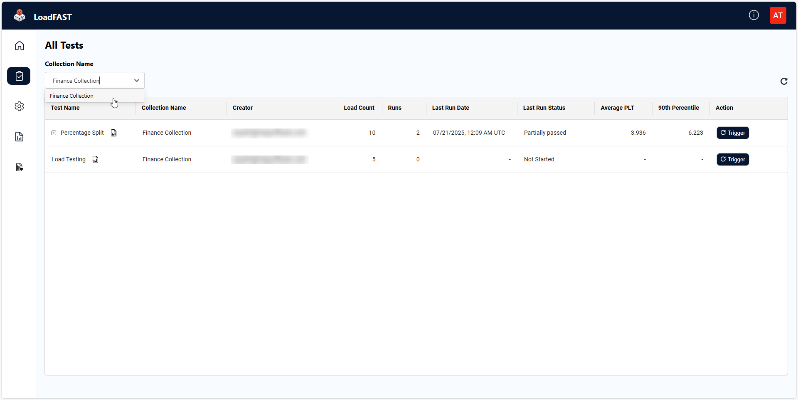<figcaption></figcaption></figure>

### Admin Settings
The Admin Settings page allows users to manage Kubernetes clusters, Insight Report, Capacity Report, and Load Count. It includes the following functionalities:

**Steps:**

1. Click on the **Admin Settings** icon from the sidebar.

     <figure>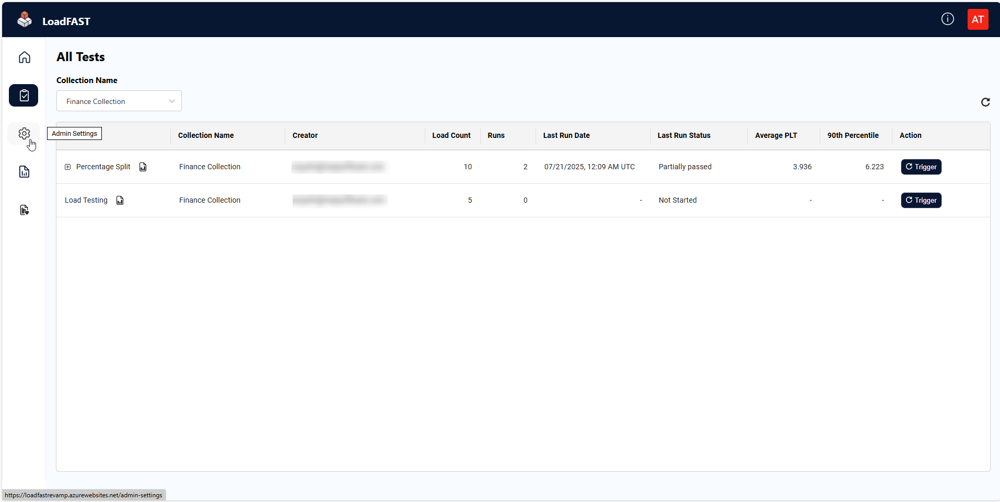<figcaption></figcaption></figure>

2. **Cluster Management:**
   - Select a **cluster** from the dropdown.
   
     <figure>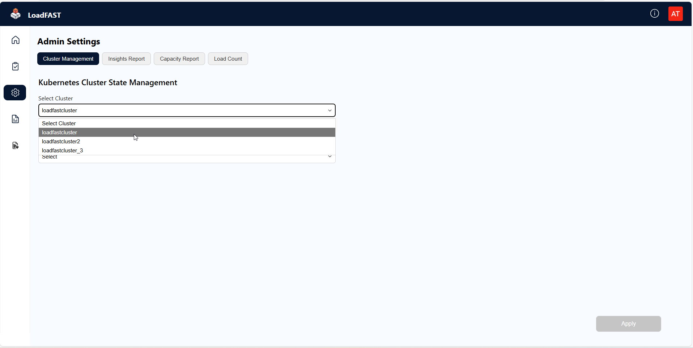<figcaption></figcaption></figure>

   - View the cluster’s current status.
     - Below it will show the status of the cluster On/Off.
     
       <figure><figcaption></figcaption></figure>

   - Choose a management type (Auto, Manual).
   
     <figure><figcaption></figcaption></figure>
     
     - **Auto:** The cluster will automatically shut down after the **Specified Hours** of inactivity.
        - To apply this setting, toggle the button **ON** and specify the number of **Hours** after which the cluster should shut down.
        
        
        **Note:** When Auto is "ON", the cluster will automatically shut down after the specified hours of inactivity. However, you must manually turn the cluster "ON" to start it initially.
        
        
        <figure>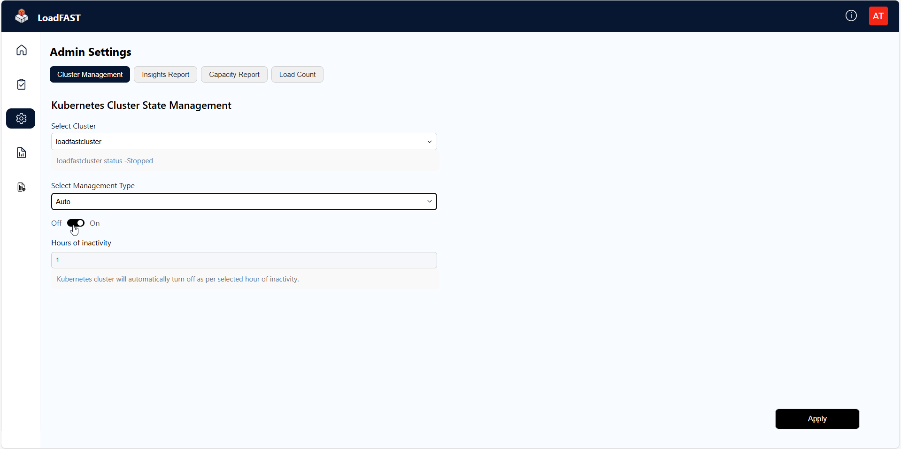<figcaption></figcaption></figure>
     
     - **Manual:** To turn the cluster ON/OFF.
        - Click the toggle button to turn the cluster ON/OFF.
        
        <figure>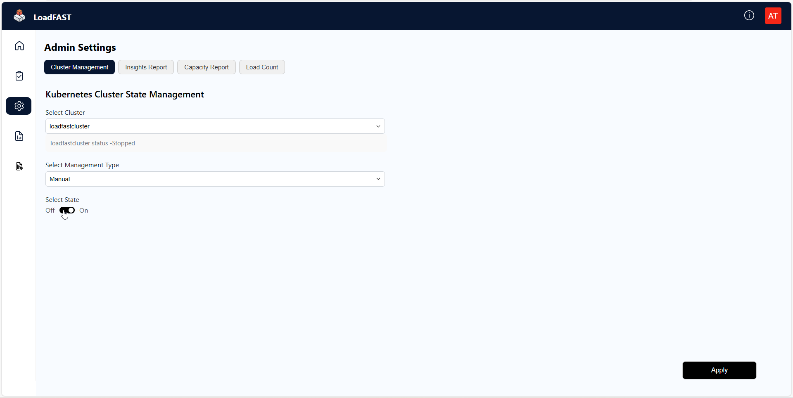<figcaption></figcaption></figure>

3. **Insights Report:** Click on **Insights Report** tab

   <figure>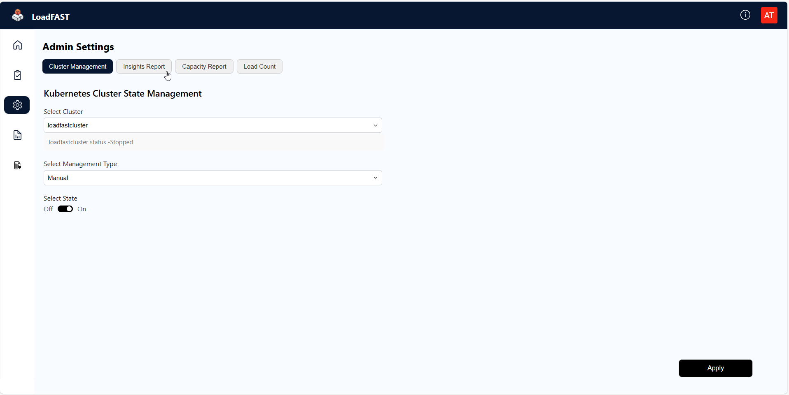<figcaption></figcaption></figure>

   - Configure the Insights Report by entering the following fields:
     - **Workspace ID:** Unique identifier for the Power BI workspace.
     - **Workspace Name (Optional):** Name for easier identification.
     - **Report ID:** Unique identifier for the report to analyze.
     - **Dataset ID:** Unique identifier for the dataset powering the report.
     - **Dataset Name (Optional):** For reference or clarity.
     
     
     **Note:** 
     - The Service Principal (SPN) used must have Admin or Member permissions on the workspace containing the Insight report.
     - The report and its dataset must also be in the same workspace.
     
     
    <figure>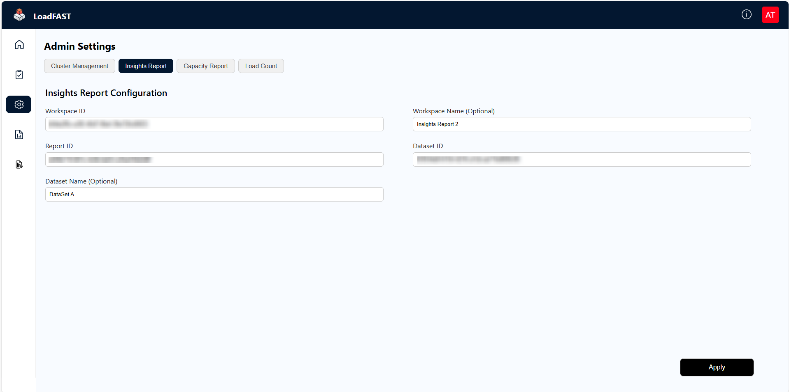<figcaption></figcaption></figure>

4. **Capacity Report:** Click on the **Capacity Report** tab.

    <figure>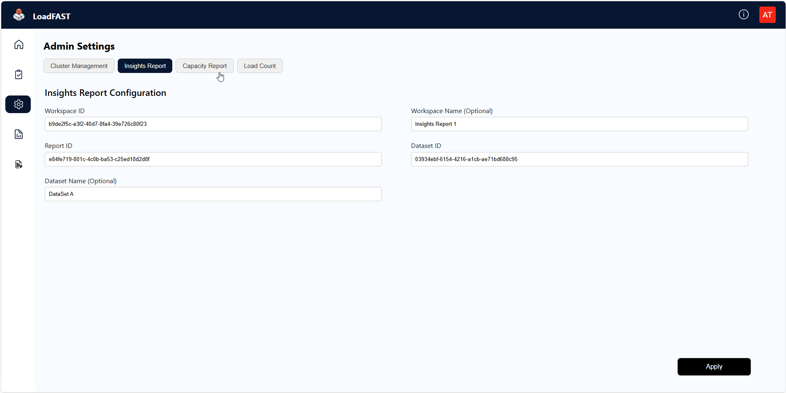<figcaption></figcaption></figure>
   
   - Set up the Capacity Report by providing:
     - **Workspace ID** and **Workspace Name (Optional)**
     - **Report ID** and **Dataset ID**
     - **Dataset Name (Optional):** e.g., Microsoft Fabric Capacity Metrics
   
    <figure>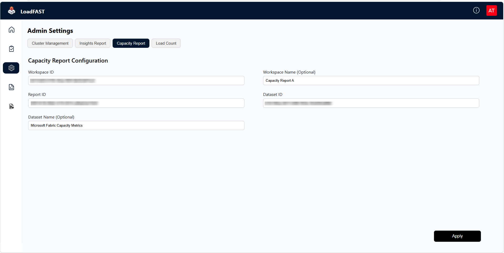<figcaption></figcaption></figure>

5. **Load Count:** Click on the **Load Count** tab.

   <figure>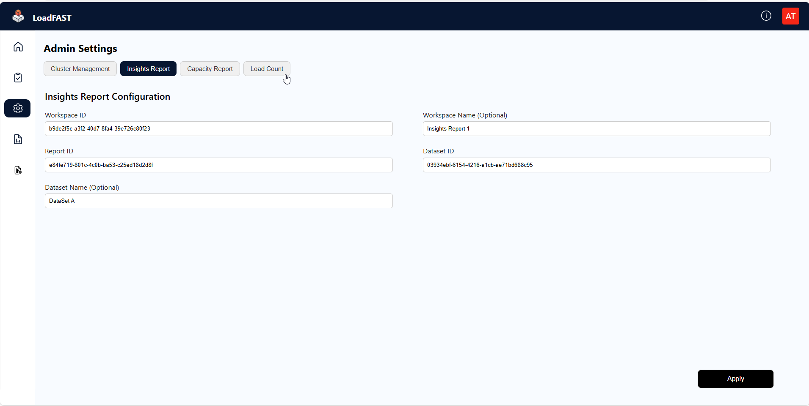<figcaption></figcaption></figure>
   
   - Update the cluster's load count by:
     - Selecting the cluster from the dropdown.
     - Viewing the maximum allowed limit.
     - Entering a new load count in Current Cluster Load Count (do not exceed the maximum limit).
   
   <figure>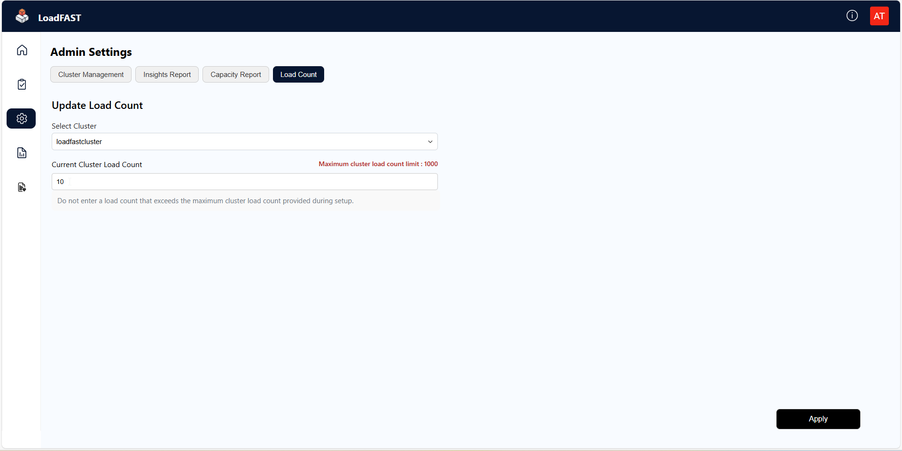<figcaption></figcaption></figure>

6. Click **Apply** button to execute the selected actions.

### Insight Report

**Overview:**
The Insights Report provides detailed performance metrics for load times, down to the visual level.

**Steps:**

1. Click on the **Insight Report** icon in the sidebar.
   
   <figure>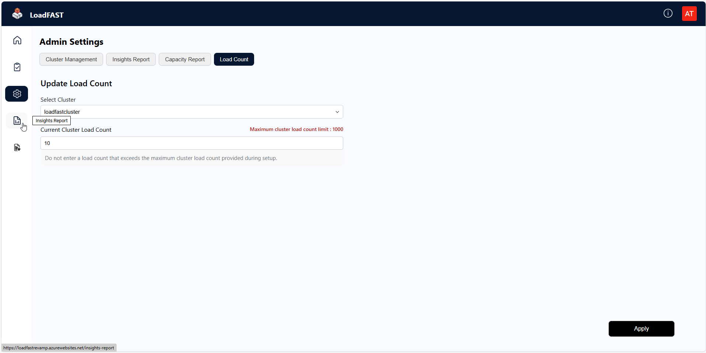<figcaption></figcaption></figure>

2. Once the report is loaded, select the desired collection from the **Collection Name** slicer.
   
   <figure>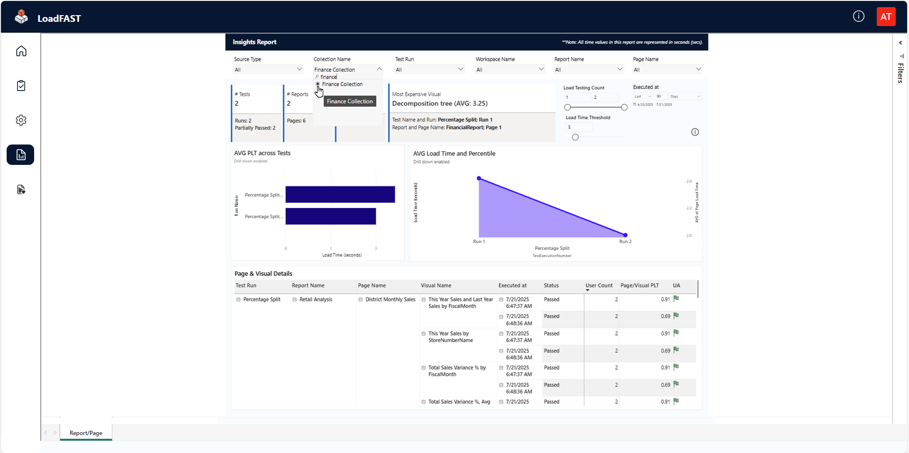<figcaption></figcaption></figure>

   - Users can also select additional filters such as **Test Run/Workspace Name/Report Name/Page Name** to refine the output.

3. View the metrics for the selected slicers:

   - **Tests:** Displays the total number of tests conducted for the selected collection.
   - **Reports:** Shows the total number of reports tested.
   - **Pages:** Indicates the total number of pages tested.
   - **Runs:** Provides the total number of test runs and their status (e.g., Partially Passed).
   - **AVG PLT (Average Page Load Time):** Displays the average page load time across the report.
   - **Most Expensive Visual:** Highlights the visual element with the highest load time.
   - **Test Name and Test Run:** Displays the test name and run associated with the most expensive visual.
   
   <figure>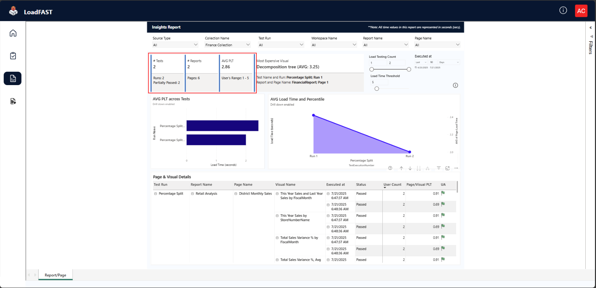<figcaption></figcaption></figure>

4. Below the metrics, view the **Bar Chart** and **Line Chart**:

   - **AVG PLT Across Tests (Bar Chart):** Displays a bar chart showing the average page load time for each test run.  

     - Each bar represents the average page load time for a specific test run, 1st Bar indicate specific run has higher load time and need optimization.
     
     <figure><figcaption></figcaption></figure>
   
   - **AVG Load Time and Percentile (Line Chart):** This chart shows how average load times and percentiles change across test runs.

     - The chart shows how average load time change across test runs, the shaded area highlights the trend and the points show the average load time for each run.
     
     <figure>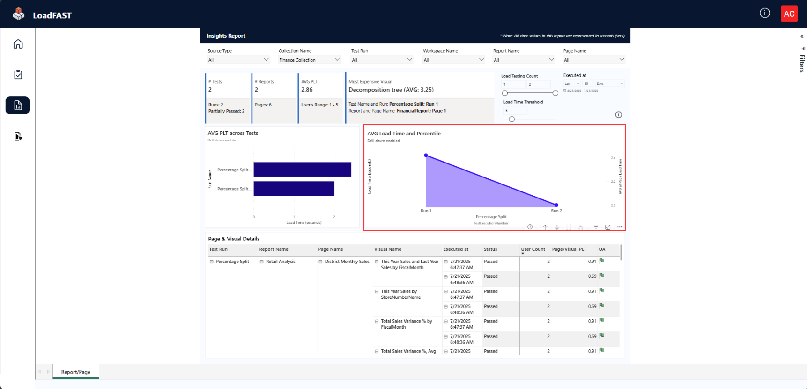<figcaption></figcaption></figure>

5. Scroll down to the **Page & Visual Details Table** to see detailed information about the collection:

   - **Test Run:** Lists the test runs conducted.
   - **Report Name:** Displays the name of the report associated with the test run.
   - **Page Name:** Indicates the specific page tested.
   - **Visual Name:** Shows the name of the visual element tested.
   - **Executed At:** Provides the timestamp of when the test was executed.
   - **Status:** Displays the status of the test (e.g., Passed, Failed).
   - **User Count:** Indicates the number of users simulated during the test (load count).
   - **Page/Visual PLT:** Shows the page or visual load time.
   - **UA:** Displays if any user action is applied.
   
   <figure>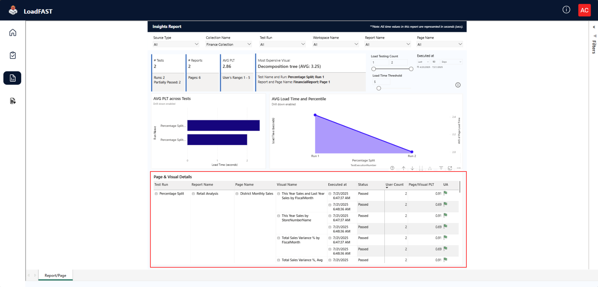<figcaption></figcaption></figure>

6. To drill through for a detailed view:

   - Right-click on **Test Run/Report Name/Page Name/Visual Name**.
   - Select **Drill Through** from the dropdown, then choose **User Action** or **Visual** to view detailed metrics instead of average.
   
     <figure>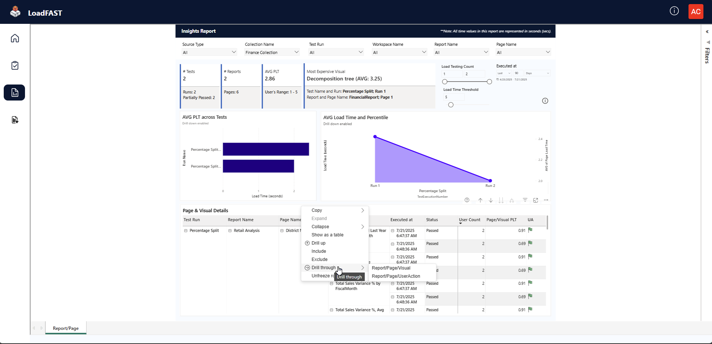<figcaption></figcaption></figure>

7. Drill-through options:

   - **User Action:** Analyze specific user interactions applied during the test run.
   
     <figure>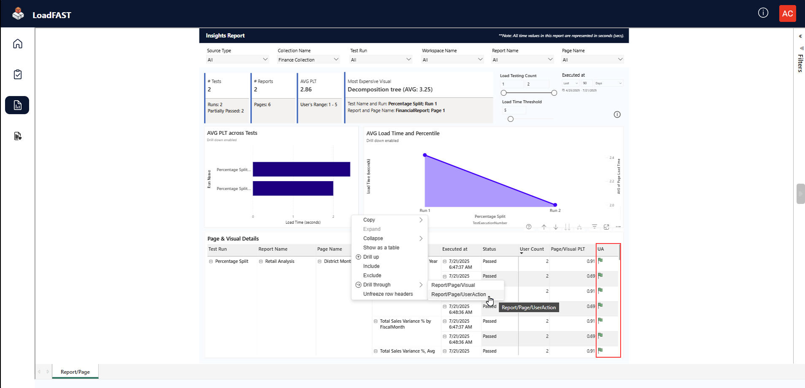<figcaption></figcaption></figure>
     
     - After clicking, you will see a detailed view of the selected interaction.
     
       <figure>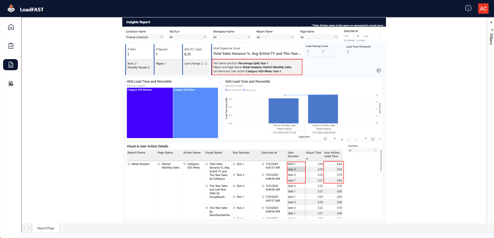<figcaption></figcaption></figure>
   
   - **Visual:** Focus on individual visuals within a report for detailed performance metrics.
   
     <figure><figcaption></figcaption></figure>
     
     - After clicking, you will see a detailed view of the selected visual.
     
       <figure>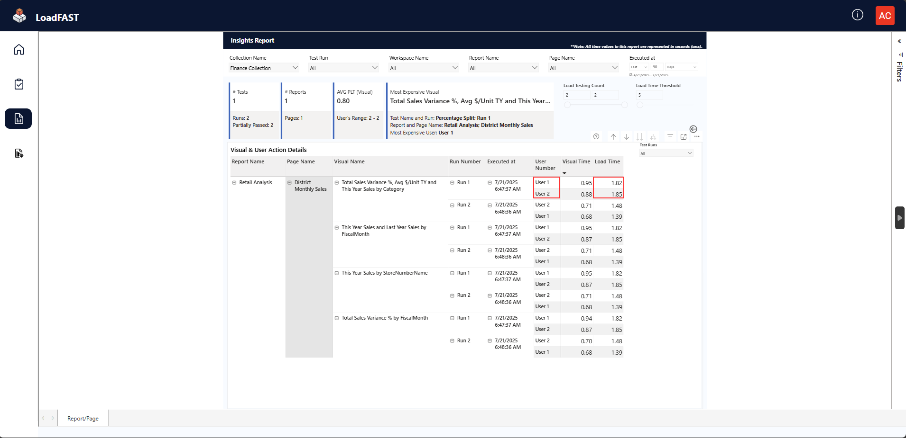<figcaption></figcaption></figure>

8. Click the **Back** button to return to the previous view.
   
   <figure>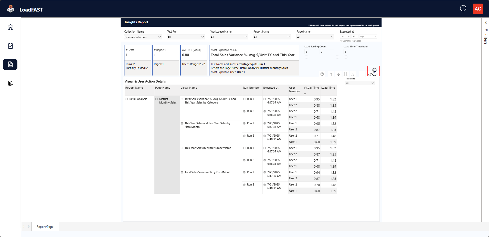<figcaption></figcaption></figure>

### Capacity Report
The **Capacity Report** provides a comprehensive overview of compute and storage usage across your Microsoft Fabric environment. It includes detailed visualizations, usage metrics, and interactive charts that help monitor capacity performance, detect overages, prevent throttling, and manage storage consumption efficiently.

**Steps:**

1. Click the **Capacity Report** icon in the left sidebar.

   <figure>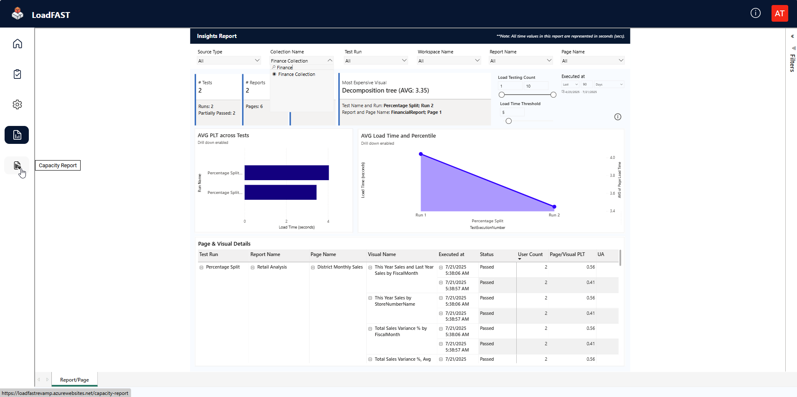<figcaption></figcaption></figure>

2. Select the **Capacity Name** from dropdown (e.g., `maqsoftwarefabric`).

   <figure>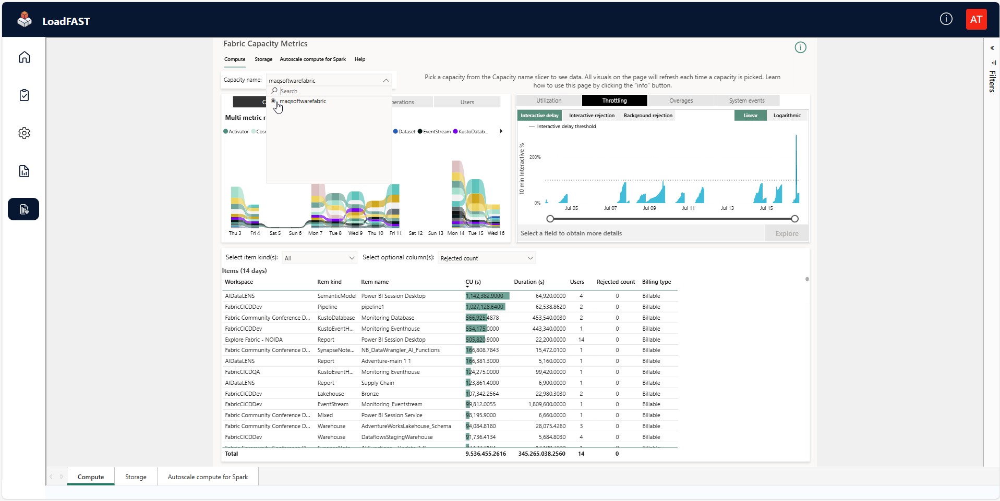<figcaption></figcaption></figure>

3. Use the tabs to explore different categories of metrics.
   

## 5. Appendix

### Glossary

| Term                  | Definition |
|-----------------------|------------|
| **RLS (Row-Level Security)** | Restricts data access based on user roles in report. |
| **Collection**        | A group of reports/pages created for load testing. |
| **Test Run**          | A user simulation to measure report performance under load. |
| **PLT (Page Load Time)** | Time taken for a report page to load fully. |
| **User Action (UA)**  | A simulated user interaction used to measure load time. |
| **Azure Kubernetes Cluster**           | Virtual machines used to simulate users during a test run. |
| **Load Count**        | Number of users simulated during a test. |
| **Editor**            | Can modify collections and create test runs. |
| **Viewer**            | Can only view test runs. |
| **Most Expensive Visual** | Visual with the highest load time. |
| **Drill Through**     | Lets you view detailed metrics from summary views. |
| **Triggered**         | The test run has started and is being executed. |

