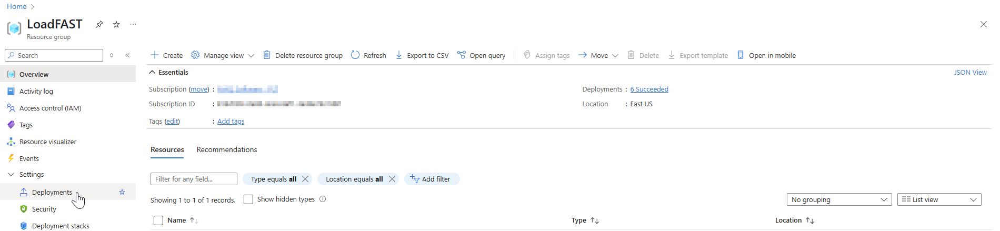
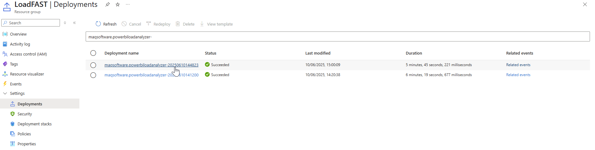
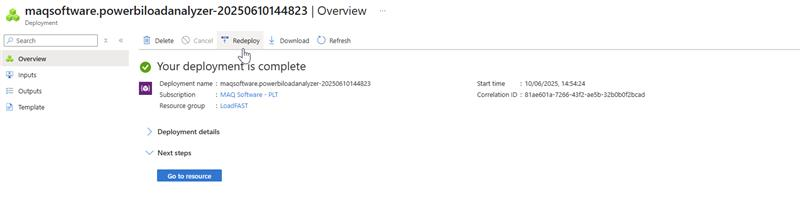
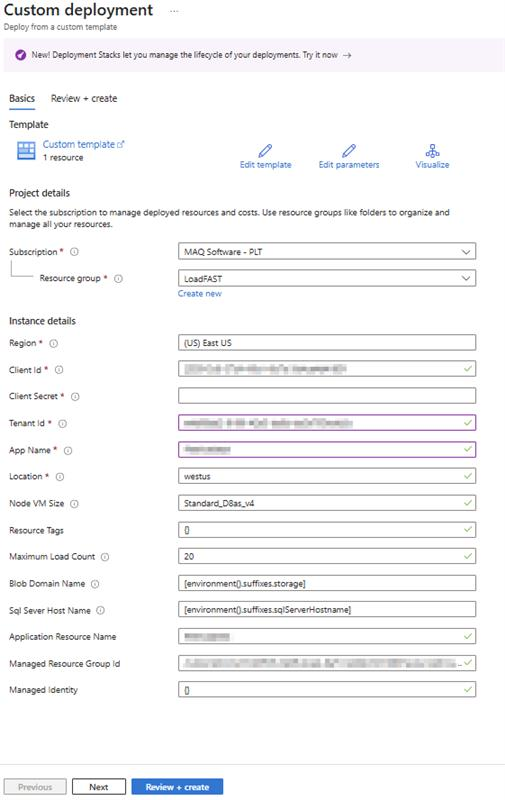
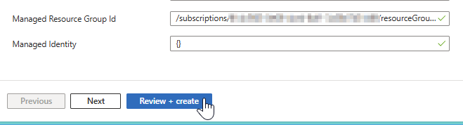
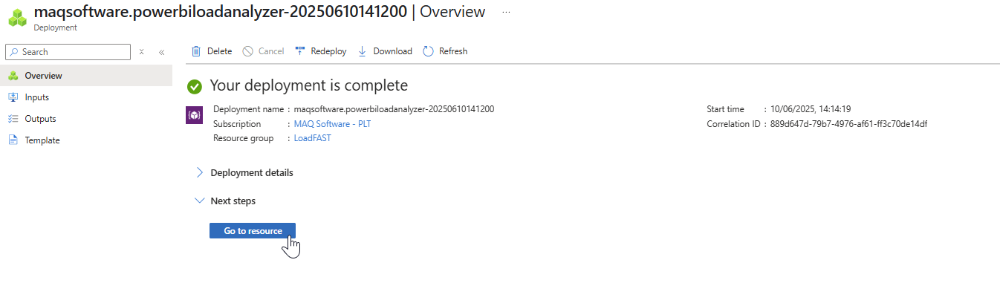

# Free app upgrades/updates

**Note**:  
   - The following steps are only for users who deployed LoadFAST [automatically via Azure Marketplace](../setting-up/deploy/deploy-automatically-via-azure-marketplace.md).
   - The Kubernetes cluster must be **ON** before starting redeployment.

To update the application, follow the steps detailed below steps.

1. Type **Resource groups** in the [Azure portal](https://portal.azure.com) search bar and select said option as it appears.
2. Once on the page, you will see a list of resource groups displayed. Select the resource group where your managed application is deployed to.
3.  Select **Deployments** (under **Settings**).

    <figure><figcaption></figcaption></figure>
4.  Select the latest deployment that is listed as **“maqsoftware.powerbiloadanalyzer-”** followed by a string of numbers (the date and time).

    <figure><figcaption></figcaption></figure>
5.  Select **Redeploy**.

    <figure><figcaption></figcaption></figure>
6.  Enter the required details **exactly** as they were entered during the [initial deployment](../setting-up/deploy/deploy-automatically-via-azure-marketplace.md#navigate-to-the-deploy-automatically-via-azure-marketplace).

    <figure><figcaption></figcaption></figure>
7.  After entering all the details, **select Review + Create**.

    <figure><figcaption></figcaption></figure>
8.  Select **Create**.

    <figure><figcaption></figcaption></figure>
9.  After the deployment is completed, select **Go to resources** to view the updated resources.

    <figure><figcaption></figcaption></figure>
10. Download the [PowerShell script file](https://links.maqsoftware.com/3EdETrg) and extract the contents to a folder on your local system. You can run the script either on **Windows** or via **Azure Cloud Shell**.

    **Running the Script on Windows:**

    1.  Press the **Windows key**, search for **Windows PowerShell ISE**, and **Run as Adminstrator**.

        <figure><figcaption></figcaption></figure>
    2.  Click on **File** > **Open...** from the top menu to open the script file.

        <figure><figcaption></figcaption></figure>
    3.  Navigate to the extracted folder and select the script inside the **LoadFAST Windows PowerShell Script** folder.

        <figure><figcaption></figcaption></figure>
    4.  Press **F5 key** or click the green **Play** button in the toolbar to execute the script.

        <figure><figcaption></figcaption></figure>
    5.  The script will begin execution and prompt you for input. Provide the required information as requested.

        <figure><figcaption></figcaption></figure>


The Windows PowerShell ISE must be opened in the same location as the downloaded PowerShell zip.


**For running script in Azure cloud shell**

1. Open [Azure portal](https://portal.azure.com) and launch **Azure cloud shell**.

<figure><figcaption></figcaption></figure>

2. Click **Switch to PowerShell**.

<figure><figcaption></figcaption></figure>

3. Click **Manage files** to upload your script.
<figure><figcaption></figcaption></figure>

4. Upload both files from **LoadFAST Azure PowerShell Script** inside the extracted folder.

<figure><figcaption></figcaption></figure>

5. Run the script using **& './Azure Cloud PowerShell Script.ps1'** command.
6.  The script will prompt you for required input. Fill in the information as needed.

<figure><figcaption></figcaption></figure>

If you see an error message after entering inputs

<figure><figcaption></figcaption></figure>

Click on **New session** and re-run the script.

<figure><figcaption></figcaption></figure>
7.  You’ll be prompted to log in. Copy the code shown and click the provided link.

   <figure><figcaption></figcaption></figure>
8.  Paste the code into the login screen and sign in with your account.

<figure><figcaption></figcaption></figure>

 9.  After logging in, enter your **client secret** when prompted. The script will now run successfully.

<figure><figcaption></figcaption></figure>
