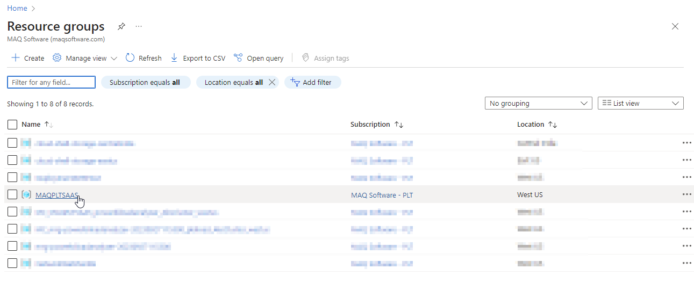
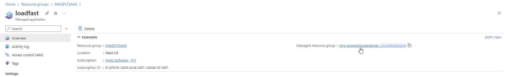
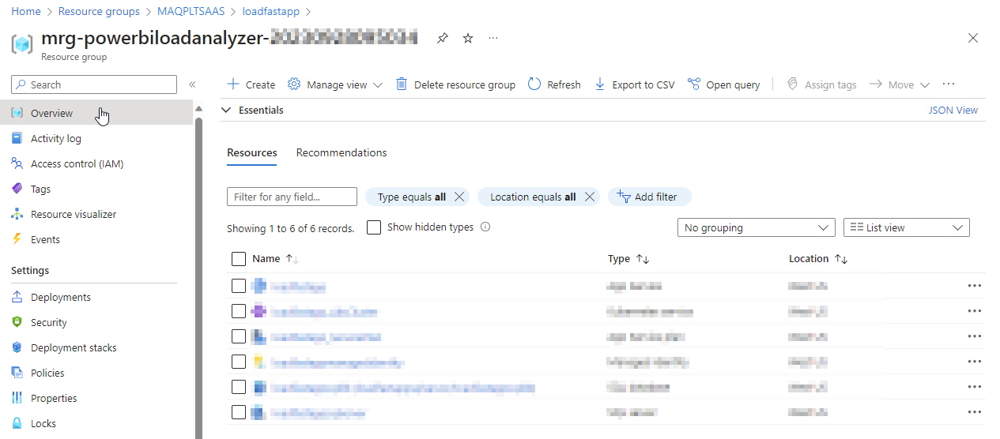
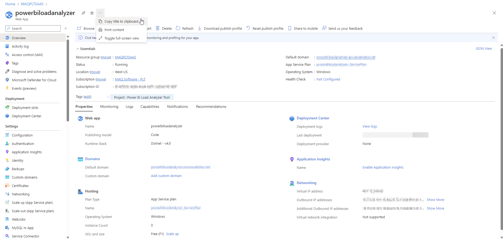
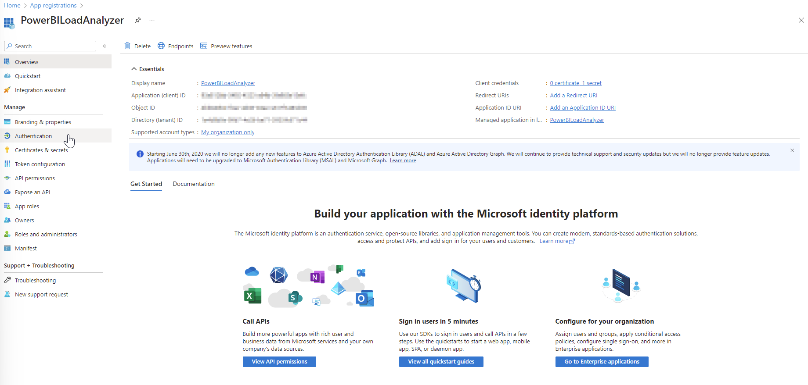
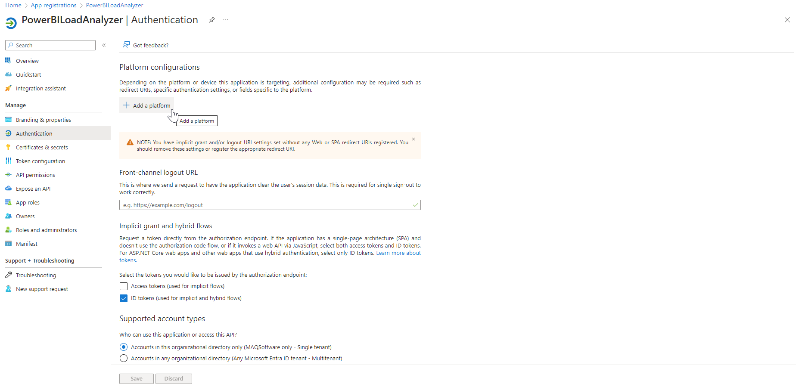

# Add the redirect URIs

## Find the web app name 

You'll need to know the name of your web app to add the redirect URI.

1.  Type “**Resource groups**" in the [Azure portal](https://portal.azure.com) search bar and select said option as it appears. &#x20;

    <figure><figcaption></figcaption></figure>
2.  Once on the page, you will see a list of resource groups displayed. Select the resource group that you have used [earlier](https://app.gitbook.com/o/y5GtRZWy1TmKHu51iTFD/s/3Am7TO0x29a6l1P0wMUg/setting-up/deployment/deploy-automatically-via-azure-marketplace#create-a-managed-application) to create the managed application.&#x20;

    <figure><figcaption></figcaption></figure>
3.  Find and select the managed application created [previously](../deploy/deploy-automatically-via-azure-marketplace.md#create-a-managed-application) as shown in the image below:&#x20;

    <figure><figcaption></figcaption></figure>
4. Select the **Managed resource group.**

<figure><figcaption></figcaption></figure>

5. An overview page will open which will display all the resources.&#x20;

<figure><figcaption></figcaption></figure>

6. Your web app will look like the item highlighted in the image below. Note down its full name.

<figure><figcaption></figcaption></figure>

7. Alternatively, clicking the app's name takes you to its summary page where you can directly copy the web app name.

<figure><figcaption></figcaption></figure>

## Navigate to the redirect URIs section 

1.  Type “**App registrations**" in the [Azure portal](https://portal.azure.com/) search bar and select said option as it appears.

    <figure><figcaption></figcaption></figure>
2.  Click on **Owned applications** to see a list of applications you registered and click on the application you registered [earlier](../prepare/pre-deployment/create-an-app-registration-for-the-loadfast-api.md#create-an-app-registration).&#x20;

    <figure><figcaption></figcaption></figure>
3.  Select **Authentication** (under Manage) from the left pane.

    <figure><figcaption></figcaption></figure>
4.  Click on **Add a platform**.​

    <figure><figcaption></figcaption></figure>
5.  Select **Single-page application** from the right-pane.

    <figure><figcaption></figcaption></figure>
6.  Enter the redirect URI for the web app in the **Redirect URIs** field. Click on **Configure** to save the changes.

    <figure><figcaption></figcaption></figure>



**Note**: The user web app URI will be in this format: “https://<_**name**_>.azurewebsites.net/”, where _**name**_ will be replaced with the web app name found in the [previous steps](add-the-redirect-uris.md#navigate-to-the-redirect-uris-section).



    
