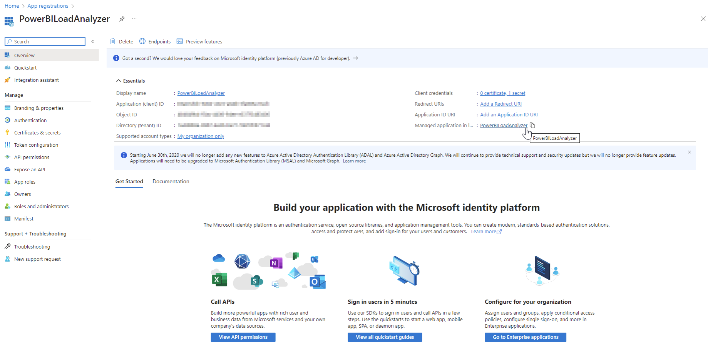
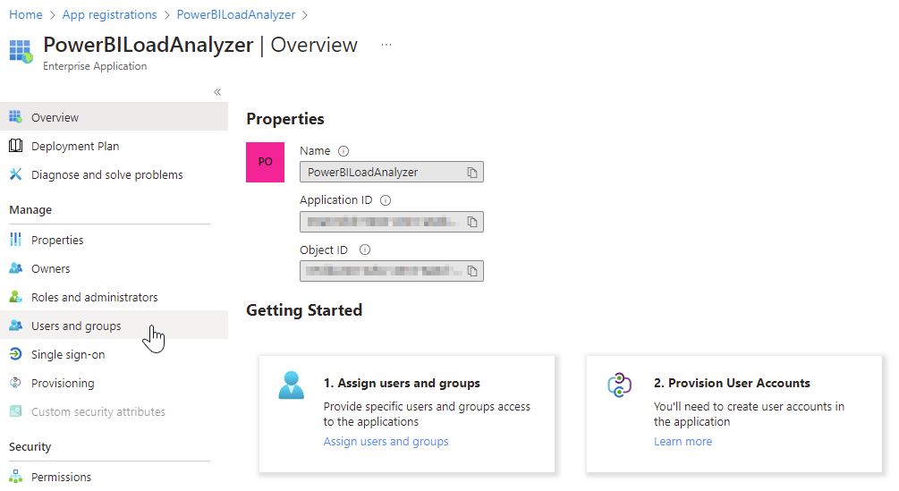
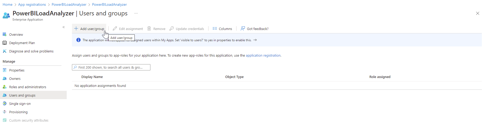
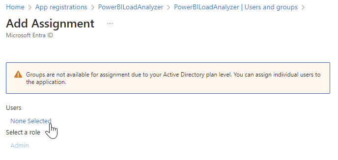
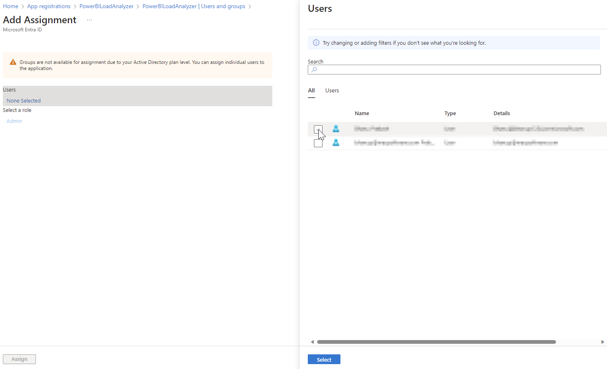
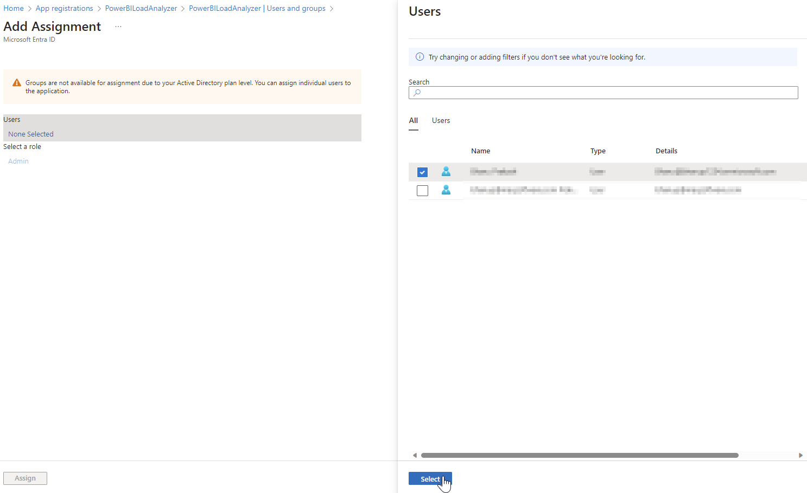
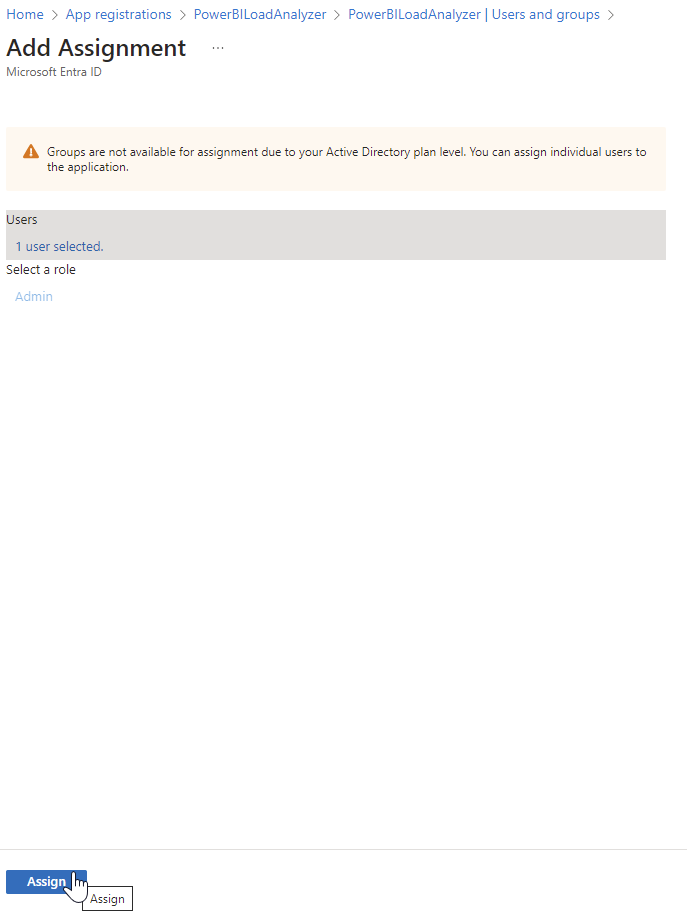
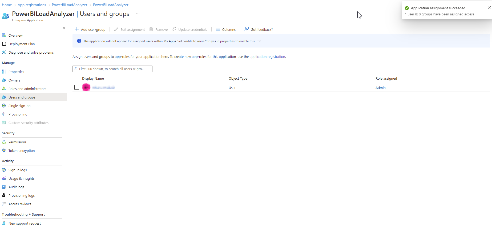

# Assign admin roles in the application

1.  Type “**App registrations**" in the [Azure portal](https://portal.azure.com/) search bar and select said option as it appears.

    <figure><figcaption></figcaption></figure>
2.  Select **Owned applications** to see a list of applications you registered and select the application you registered [earlier](../prepare/pre-deployment/create-an-app-registration-for-the-loadfast-api.md#create-an-app-registration).&#x20;

    <figure><figcaption></figcaption></figure>
3.  Select the **managed application**.&#x20;

    <figure><figcaption></figcaption></figure>
4.  An overview page will appear. Select **Users and groups** (under Manage) from the left pane.&#x20;

    <figure><figcaption></figcaption></figure>
5.  Select **Add user/group**.&#x20;

    <figure><figcaption></figcaption></figure>
6.  Select the **None Selected** text.&#x20;

    <figure><figcaption></figcaption></figure>
7.  Search for the user ID(s) requiring admin access in the search bar.

    <figure><figcaption></figcaption></figure>
8.  Tick the box next to the name(s) and click **Select**.&#x20;

    <figure><figcaption></figcaption></figure>
9.  Click **Assign** to complete the process.&#x20;

    <figure><figcaption></figcaption></figure>
10. The admin role is now assigned.\

    <figure><figcaption></figcaption></figure>
