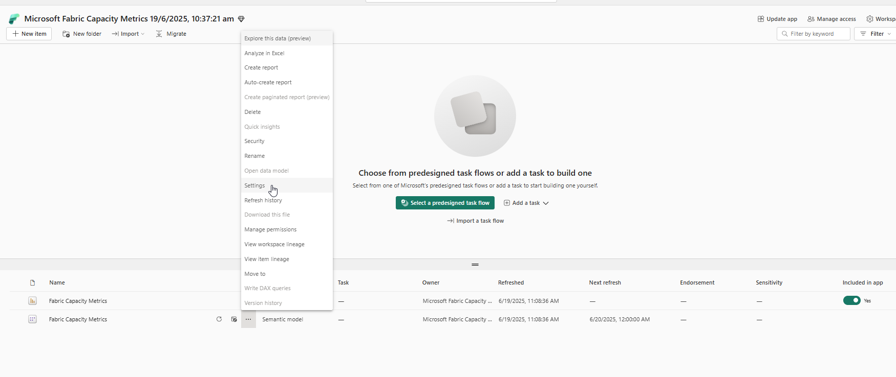
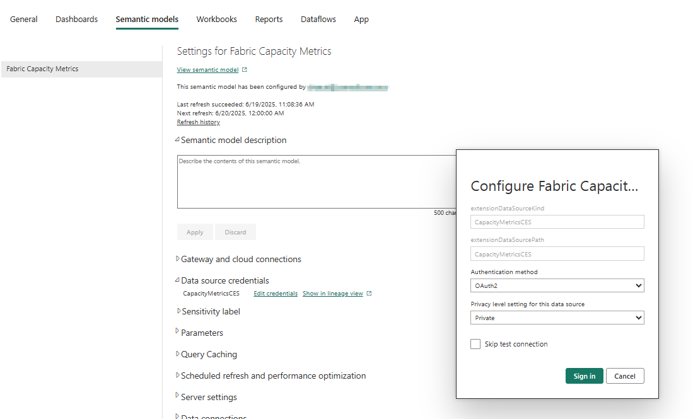
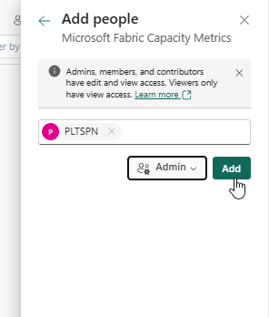
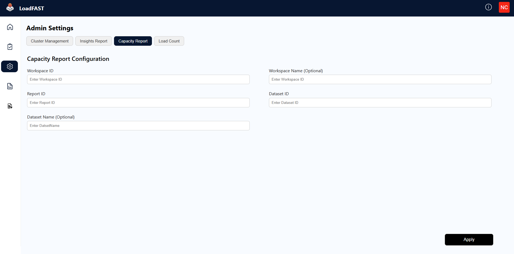
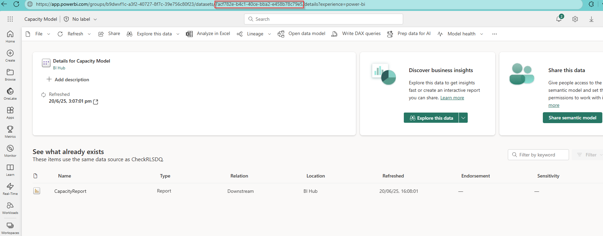
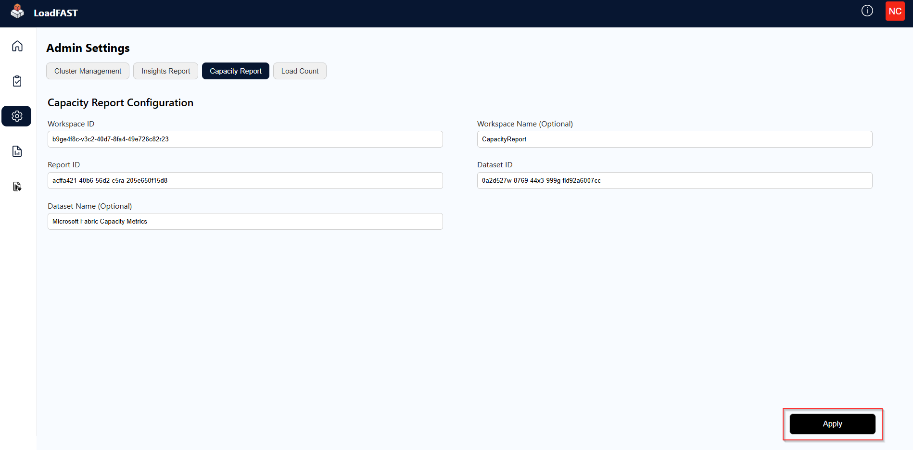
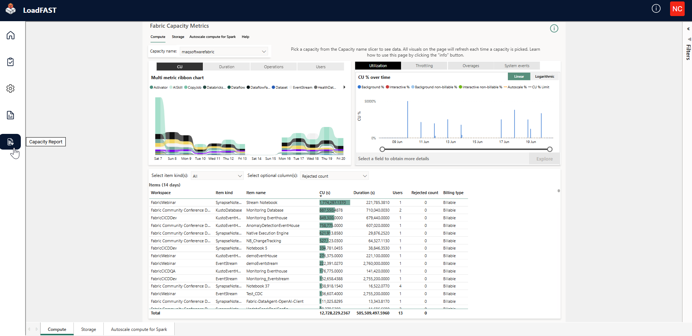

# Capacity Report

## Introduction

This guide provides detailed instructions for configuring and deploying the Power BI Capacity Report. It covers installing the Microsoft Fabric Capacity Metrics app, saving a copy to your workspace, and configuring the report on the portal.


The following steps must be performed by a user with **admin** access to the **Fabric Capacity**.


## Installing the Microsoft Fabric Capacity Metrics App

1. Follow the comprehensive installation steps provided in the official [Microsoft documentation.](https://learn.microsoft.com/en-us/fabric/enterprise/metrics-app-install).
2. Once installed, navigate to the **Settings** of the semantic model associated with the capacity report to refresh it.

<figure><figcaption></figcaption></figure>

3. Under **Data souce credentials**, click **Edit credentials**.
4. Set the authentication method to **OAuth2**, then click **Sign in**.

<figure><figcaption></figcaption></figure>

5. After signing in, **Refresh** the semantic model.
6. Go to **Manage Access** and grant **Admin** access to the **PLTSPN**.

<figure><figcaption></figcaption></figure>

## Configuration process

### To access capacity report on the portal:

1. Navigate to **Admin Settings** and open the **Capacity Report** section.

<figure><figcaption></figcaption></figure>

2. Open the capacity report in your workspace.

3. Obtain the required identifiers from Power BI service:&#x20;

* **Workspace ID**: Located in the URL after "groups/"

<figure><figcaption></figcaption></figure>

* **Report ID**: Located in the URL after "reports/"

<figure><figcaption></figcaption></figure>

* **Dataset ID**: Access the semantic model used by the report and extract the ID from the URL after "datasets/"

<figure><figcaption></figcaption></figure>

4. Enter these identifiers in their respective fields on the portal configuration page.
5. Click **Apply** to save your configuration.

<figure><figcaption></figcaption></figure>

6. Access your report by clicking on **Capacity Report** in the navigation menu.

<figure><figcaption></figcaption></figure>

