# Execute the PowerShell Script in Windows PowerShell ISE

## Set up PowerShell

1. Download the [PowerShell script file](https://links.maqsoftware.com/3EdETrg) and extract the contents to a folder on your local system. You can run the script either on **Windows** or via **Azure Cloud Shell**.

    **Running the Script on Windows:**
    1. Press the **Windows key**, search for **Windows PowerShell ISE**, and **Run as Adminstrator**.

        <figure>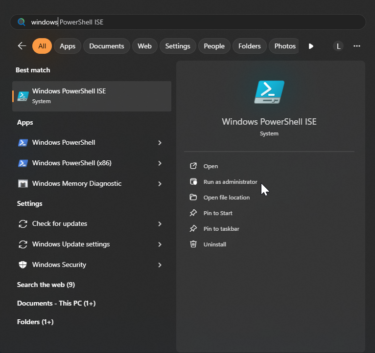<figcaption></figcaption></figure>

    2. Click on **File** > **Open...** from the top menu to open the script file.

        <figure>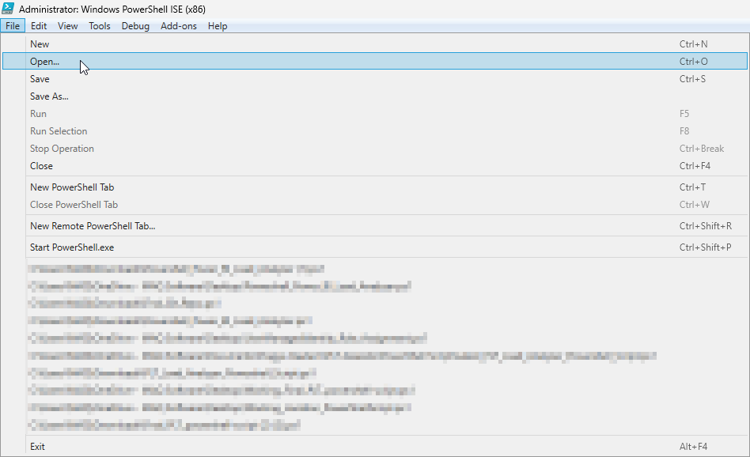<figcaption></figcaption></figure>

    3. Navigate to the extracted folder and select the script inside the **LoadFAST Windows PowerShell Script** folder.&#x20;

        <figure>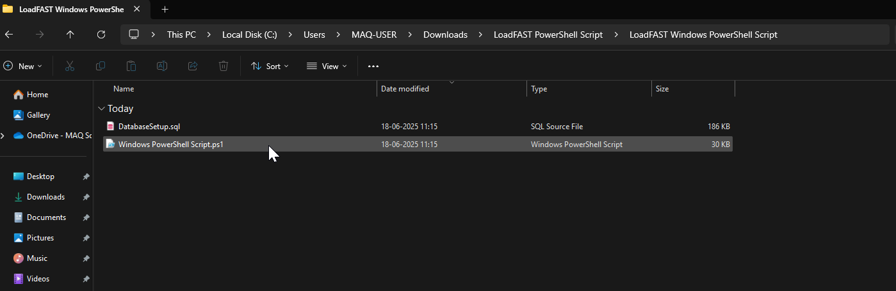<figcaption></figcaption></figure>
    4. Press **F5 key** or click the green **Play** button in the toolbar to execute the script.&#x20;

        <figure><figcaption></figcaption></figure>
    5. The script will begin execution and prompt you for input. Provide the required information as requested.

        <figure><figcaption></figcaption></figure>

The Windows PowerShell ISE must be opened in the same location as the downloaded PowerShell zip.
   

**For running script in Azure cloud shell**
1. Open [Azure portal](https://portal.azure.com) and launch **Azure cloud shell**.

    <figure>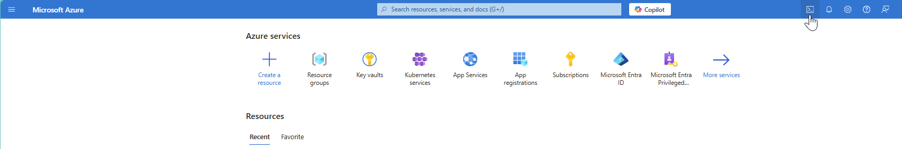<figcaption></figcaption></figure>

2. Click **Switch to PowerShell**.

    <figure>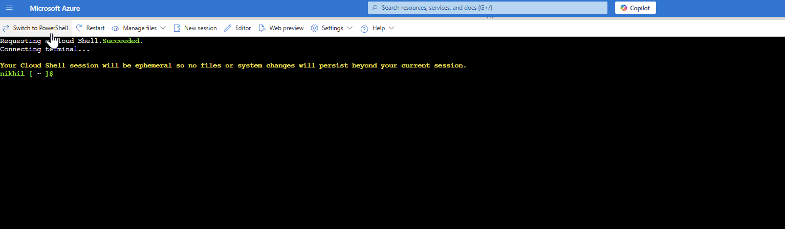<figcaption></figcaption></figure>

3. Click  **Manage files** to upload your script.

    <figure>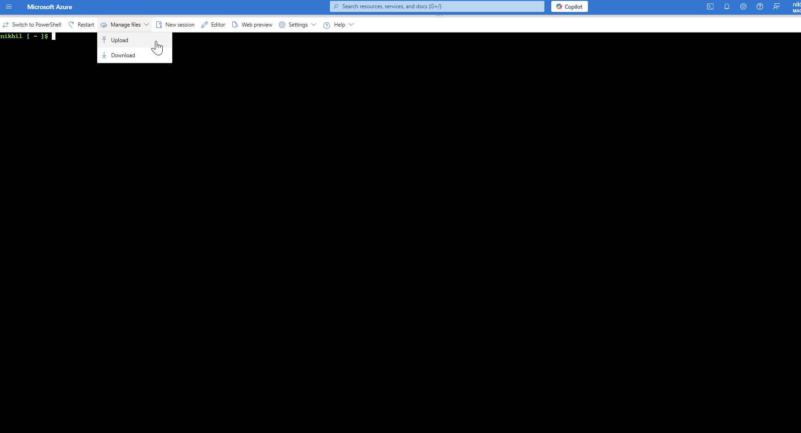<figcaption></figcaption></figure>

4. Upload both files from **LoadFAST Azure PowerShell Script** inside the extracted folder.

    <figure>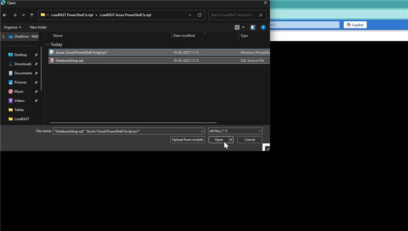<figcaption></figcaption></figure>

5. Run the script using **& './Azure Cloud PowerShell Script.ps1'** command.

6. The script will prompt you for required input. Fill in the information as needed.

    <figure><figcaption></figcaption></figure>

    If you see an error message after entering inputs

    <figure>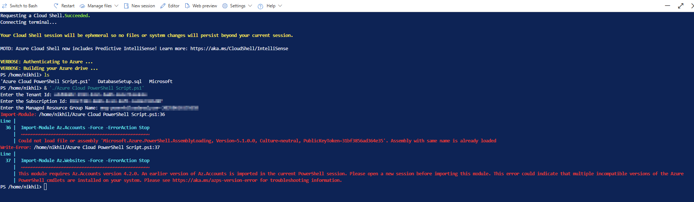<figcaption></figcaption></figure>

    Click on **New session** and re-run the script.

    <figure>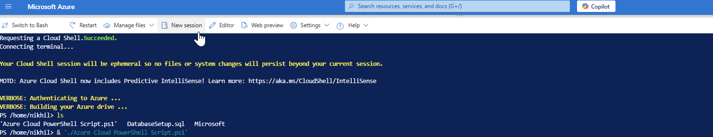<figcaption></figcaption></figure>

7. You’ll be prompted to log in. Copy the code shown and click the provided link.

    <figure>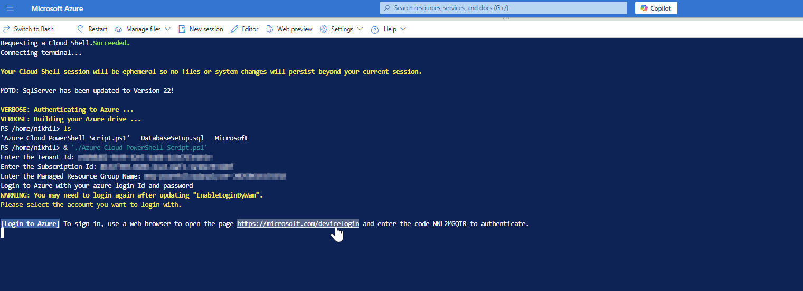<figcaption></figcaption></figure>

8. Paste the code into the login screen and sign in with your account.

    <figure>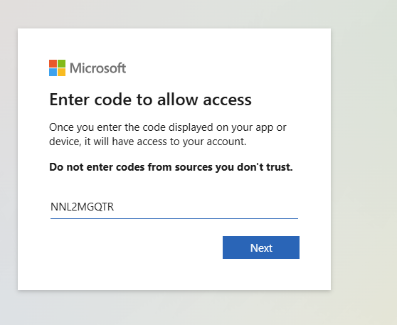<figcaption></figcaption></figure>

9. After logging in, enter your **client secret** when prompted. The script will now run successfully.

    <figure>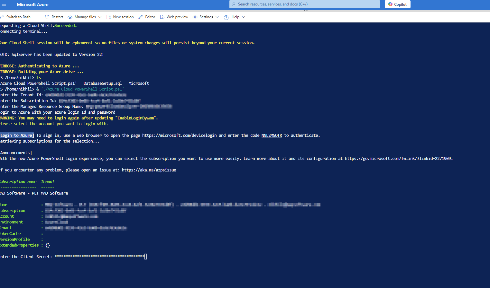<figcaption></figcaption></figure>

## Provide inputs for the prompts

### **Enter your tenant ID**

Follow the steps below to find your tenant ID:

1.  Type “**App registrations**" in the [Azure portal](https://portal.azure.com) search bar and select said option as it appears.&#x20;

    <figure><figcaption></figcaption></figure>
2.  Find and select the application registration [previously created](https://maqsoftware.gitbook.io/pbi-load-analyzer-technical-documentation/setting-up/pre-deployment/create-an-app-registration-for-the-loadfast-api#create-an-app-registration) for the LoadFAST API on the list.&#x20;

    <figure><figcaption></figcaption></figure>
3.  This takes you to its summary page where you can find the directory (tenant) ID and copy it directly to your clipboard.&#x20;

    <figure>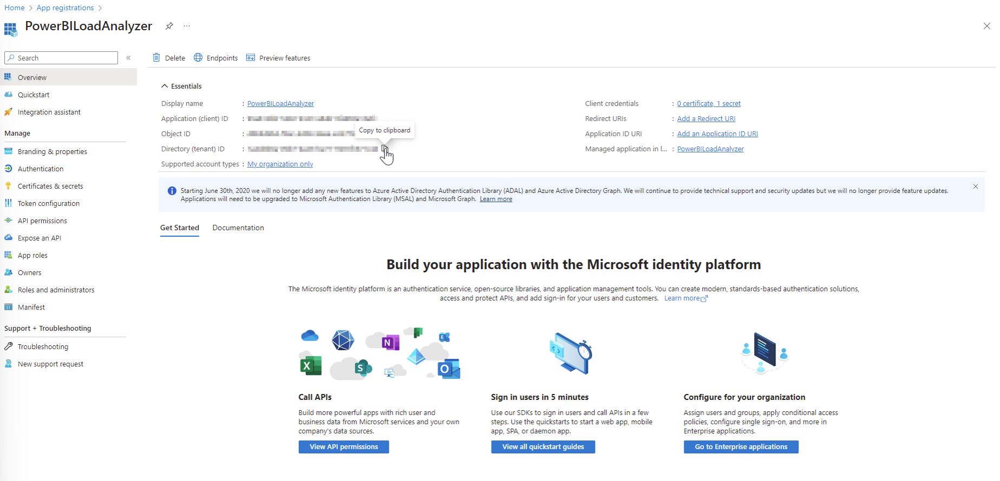<figcaption></figcaption></figure>
4. In the PowerShell terminal, paste/enter the subscription ID from the previous step.

### **Enter your subscription ID**

Follow the steps below to find your subscription ID:

1.  Type “**Resource groups**" in the [Azure portal](https://portal.azure.com) search bar and select said option as it appears.&#x20;

    <figure><figcaption></figcaption></figure>
2.  Once on the page, you will see a list of resource groups displayed. Select the resource group where you want to deploy the tool resources to. This can be resource group&#x20;

    <figure><figcaption></figcaption></figure>
3.  Copy the subscription ID as shown below.&#x20;

    <figure>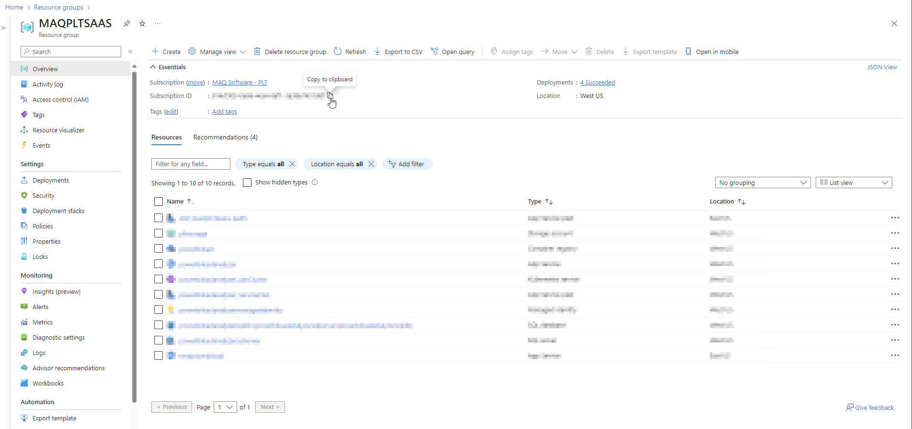<figcaption></figcaption></figure>
4. In the PowerShell terminal, paste/enter the subscription ID from the previous step.&#x20;

### **Enter your resource group name**

1.  Type “Resource groups" in the Azure portal search bar and select said option as it appears.

    <figure><figcaption></figcaption></figure>
2.  Once on the page, you will see a list of resource groups displayed. Select the resource group that you have used [earlier](https://app.gitbook.com/o/y5GtRZWy1TmKHu51iTFD/s/3Am7TO0x29a6l1P0wMUg/setting-up/deployment/deploy-automatically-via-azure-marketplace#create-a-managed-application) to create the managed application.&#x20;

    <figure><figcaption></figcaption></figure>
3.  Find and select the managed application as shown in the image below:\

    <figure>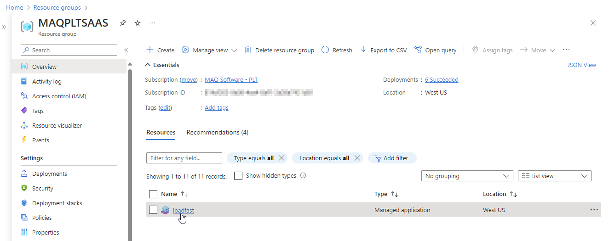<figcaption></figcaption></figure>
4. Copy the name of the managed resource group.

<figure>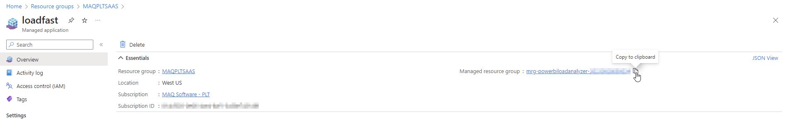<figcaption></figcaption></figure>

5. Paste/enter the managed resource group name in the PowerShell terminal like the previous steps.

### **Log into Azure through the PowerShell pop-up window**

If already logged into Azure, it will ask you to pick an account. If not, then you need to sign in with your Azure account.&#x20;

<figure>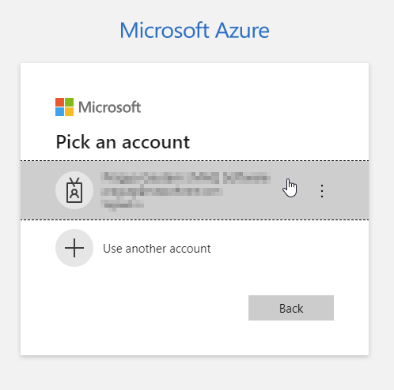<figcaption></figcaption></figure>

## Other details

*   See the output and any actions performed by the script in the console pane at the bottom of the PowerShell window.&#x20;

    <figure>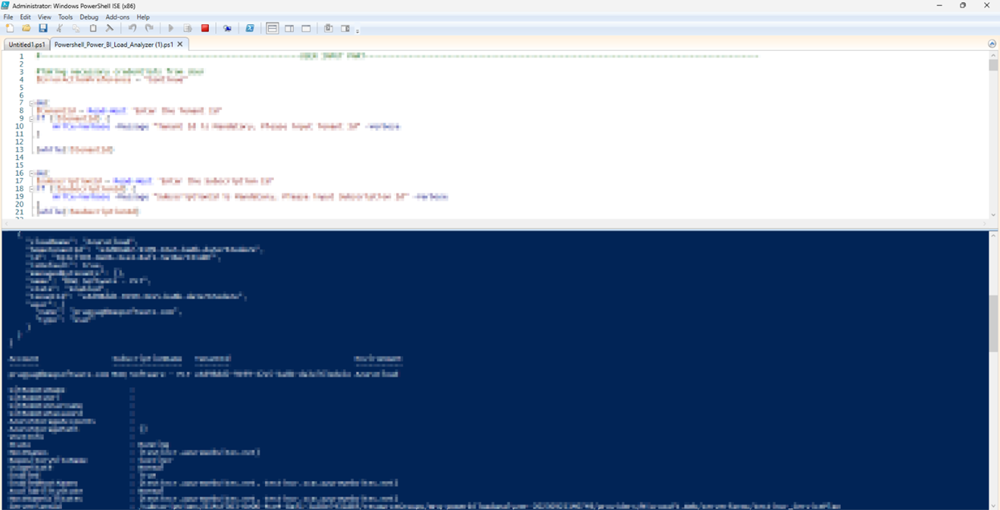<figcaption></figcaption></figure>
* To verify the backend deployment, follow these steps:
  1.  Type “**Kubernetes services**" in the Azure portal search bar and select said option as it appears.&#x20;

      <figure><figcaption></figcaption></figure>
  2.  Once on the page, you will see a list of Kubernetes clusters displayed. Select the Kubernetes cluster created for your web app (more information regarding cluster name detailed in the note).


**Note:** Kubernetes clusters are automatically created and named as follows: "**WebAppName**\_AksCluster".&#x20;

In our case, our web app was named "**powerbiloadanalyzer**" (as seen in step 4 of this [process](https://maqsoftware.gitbook.io/pbi-load-analyzer-technical-documentation/setting-up/deployment/deploy-automatically-via-azure-marketplace#create-a-managed-application)). Thus, our Kuberenetes cluster name is "powerbiloadanalyzer\_AksCluster".&#x20;
<figure>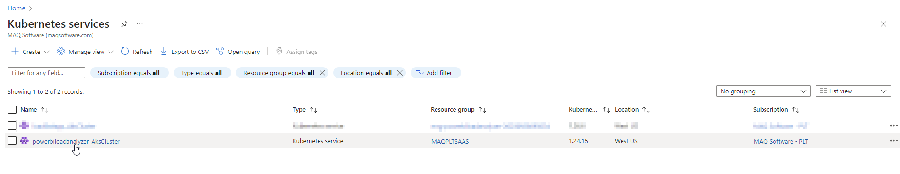<figcaption></figcaption></figure>

3.  Select **Workloads** (under Kubernetes resources) from the left pane.&#x20;
<figure><figcaption></figcaption></figure>

4.  Under the **Deployments** tab, you can see all the deployments. Ensure that they all have a green tick in the **Ready** column.&#x20;
<figure>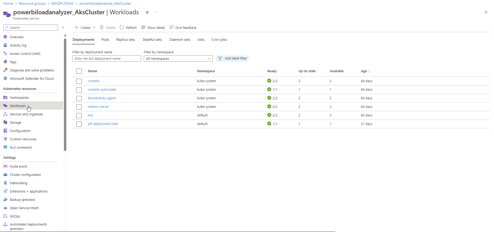<figcaption></figcaption></figure>
