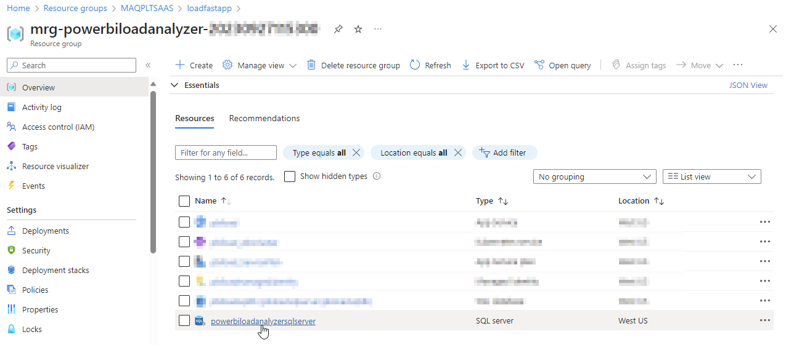
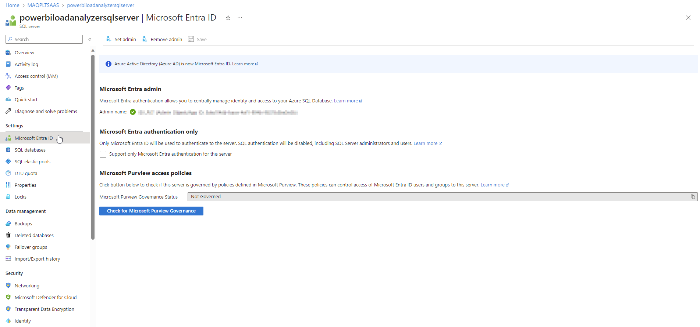
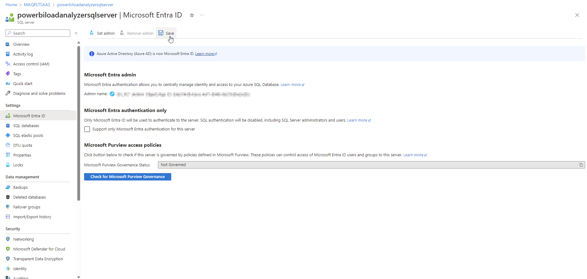

# Grant admin-level privileges on Azure SQL database

In order to run the PowerShell script required in the [next section](execute-the-powershell-script-in-windows-powershell-ise.md), admin-level access on the Azure SQL database is required.

1.  Type “**Resource groups**" in the [Azure portal](https://portal.azure.com) search bar and select said option as it appears.&#x20;

    &#x20;

    <figure><figcaption></figcaption></figure>
2.  Find the managed resource group that was created earlier in the deployment process (step 6 of the[ managed application creation process](../deploy/deploy-automatically-via-azure-marketplace.md#create-a-managed-application)).&#x20;

    <figure><figcaption></figcaption></figure>
3.  An overview page will open which will display all the resources. Select the SQL database server.&#x20;

    <figure><figcaption></figcaption></figure>
4.  Select **Microsoft Entra ID** (under Settings) from the left pane.&#x20;

    <figure><figcaption></figcaption></figure>
5.  Click on **Set admin** and search for the security group created earlier in the search bar. Click on **Select**.&#x20;

    <figure><figcaption></figcaption></figure>
6.  Click on **Save**.&#x20;

    <figure><figcaption></figcaption></figure>
