# Insight report

## Introduction

This guide provides detailed instructions for configuring and deploying the Power BI Insight Report. It covers obtaining the report, setting up necessary parameters, publishing to a workspace, and configuring the report on the portal.

## Obtaining the Power BI report

1. Download the Power BI report by [clicking here](https://pltstorage.blob.core.windows.net/pltblob/LoadFAST_Insight_Report.pbix).
2. Open the downloaded file using Power BI Desktop application.&#x20;
3. If Power BI Desktop is not installed on your system, you can download it from the [official Microsoft download page](https://www.microsoft.com/en-us/power-platform/products/power-bi/downloads?msockid=2d9f8972b1216ccc24169ddbb0ba6d71).

## Report features

The Power BI Insight Report offers comprehensive analytics on test performance and collection metrics, including:

* Test status breakdown showing passed, failed, and partially passed tests within collections
* Collection composition metrics displaying the number of reports and pages
* Performance analysis identifying the most expensive visual with corresponding test run, report, and page details
* Detailed load time metrics at multiple levels:
  * Report level performance metrics
  * Page level load times
  * Visual level response times
  * User action performance measurements

## Configuration process

### Setting up parameters:

1. Access parameter settings by clicking on **Transform Data** in the Power BI desktop interface.

<figure>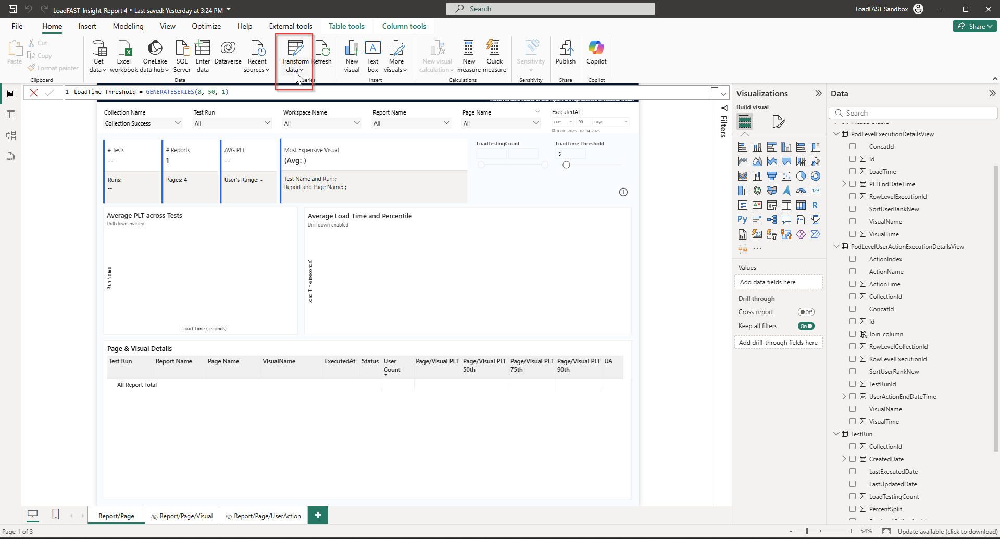<figcaption></figcaption></figure>

2. Click on **Manage Parameters.**

<figure>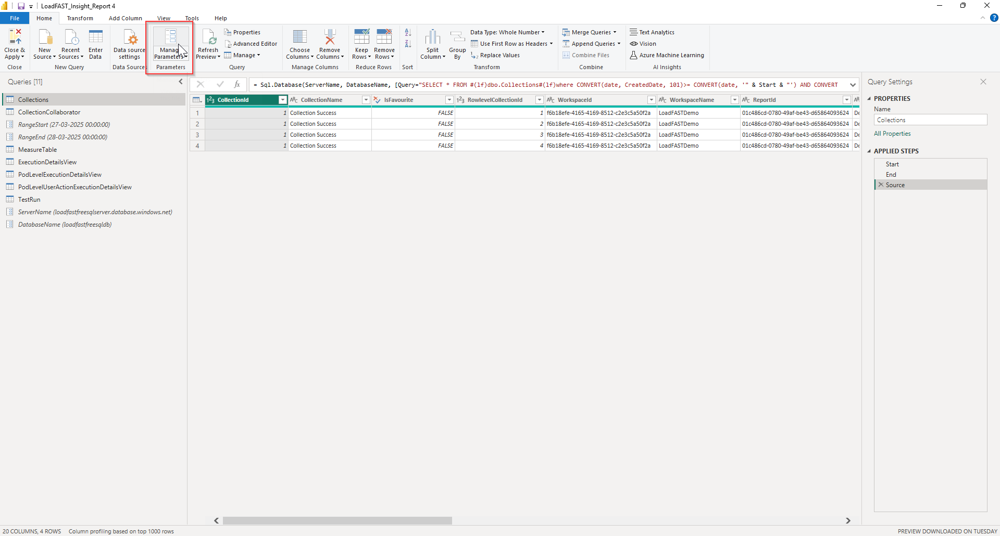<figcaption></figcaption></figure>

3. Update values for each parameter and confirm by clicking the **OK** button.
   * RangeStart: Enter the date of installation
   * RangeEnd: Enter the date of installation plus one day
   * ServerName: Use the server name provided during installation
   * DatabaseName: Use the database name provided during installation

<figure>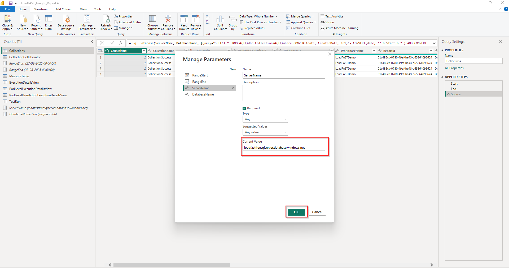<figcaption></figcaption></figure>

4. Click on the Refresh Preview to check if data is loading after updating the parameters.

<figure>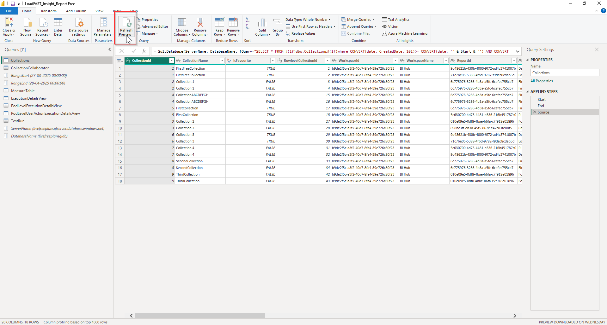<figcaption></figcaption></figure>

### Troubleshooting firewall errors

If you encounter a firewall error after refreshing the preview, follow these steps:

1. You may get an error like this after the refresh.

<figure>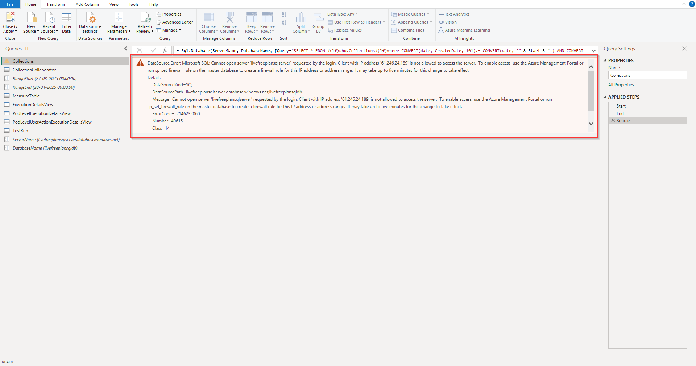<figcaption></figcaption></figure>

2. Navigate to **portal.azure.com** and search for your SQL DB.

<figure>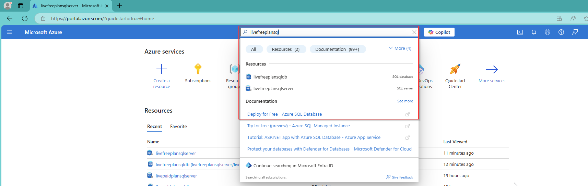<figcaption></figcaption></figure>

3. Go to the SQL DB and click on the **Set Server Firewall.**&#x20;

<figure>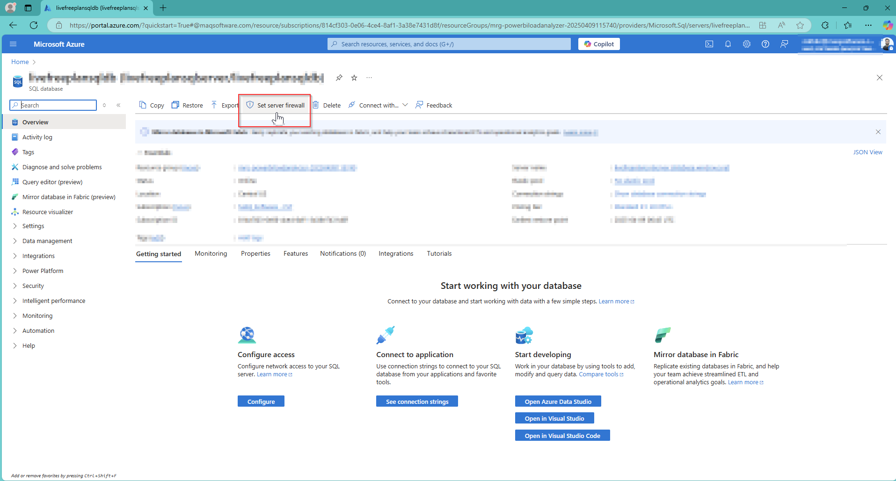<figcaption></figcaption></figure>

4. Click on **Add your Client IPv4 address** and paste the IP address you received in the error message and click **Save**.

<figure>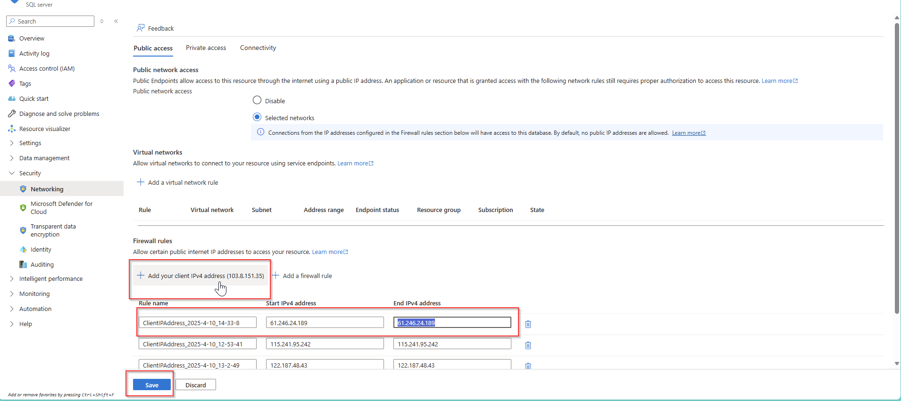<figcaption></figcaption></figure>

5. Return to Power BI Desktop and click on the **Refresh Preview** to get the updated data.

<figure>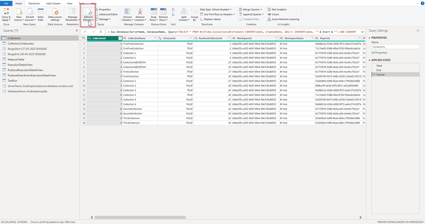<figcaption></figcaption></figure>

6. Apply your changes by selecting **Close and Apply**.

<figure>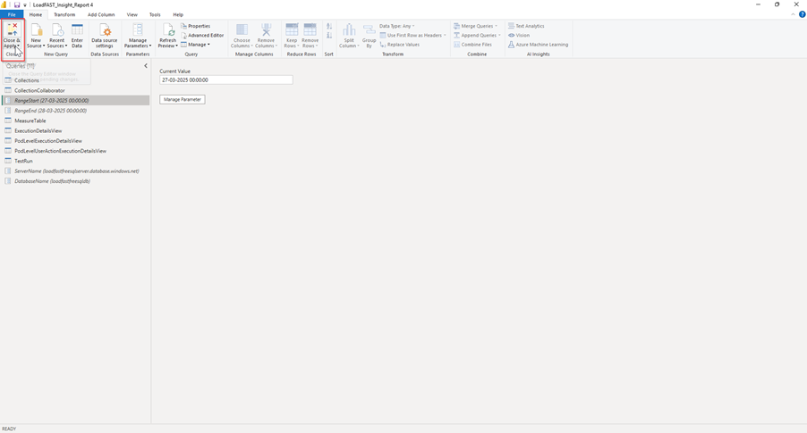<figcaption></figcaption></figure>

### Publishing the report

After configuring parameters:&#x20;

1. Click the **Publish** button in the Power BI desktop ribbon.

<figure>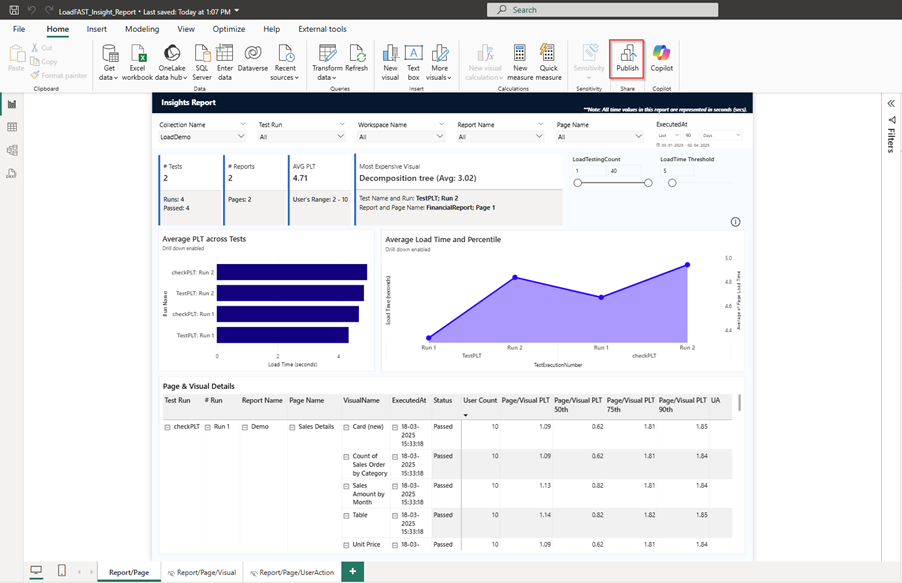<figcaption></figcaption></figure>

2. From the dialog that appears, select your target workspace.

<figure>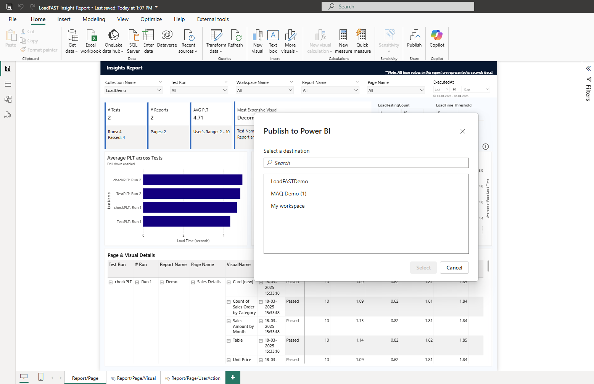<figcaption></figcaption></figure>

3. Navigate to app.powerbi.com and access the semantic model of your published report.

<figure><figcaption></figcaption></figure>

## Installing the Microsoft Fabric Capacity Metrics App

1. Follow the comprehensive installation steps provided in the official [Microsoft documentation.](https://learn.microsoft.com/en-us/fabric/enterprise/metrics-app-install).
2. Once installed, navigate to the **Settings** of the semantic model associated with the capacity report to refresh it.

<figure><figcaption></figcaption></figure>

3. Under **Data souce credentials**, click **Edit credentials**.
4. Set the authentication method to **OAuth2**, then click **Sign in**.

<figure><figcaption></figcaption></figure>

5. After signing in, **Refresh** the semantic model.
6. Go to **Manage Access** and grant **Admin** access to the **PLTSPN**.

<figure><figcaption></figcaption></figure>

### Configuring the insight report on the portal

To access insight report on the portal:

1. Navigate to **Admin Settings** and open the **Insights Report** section.

<figure>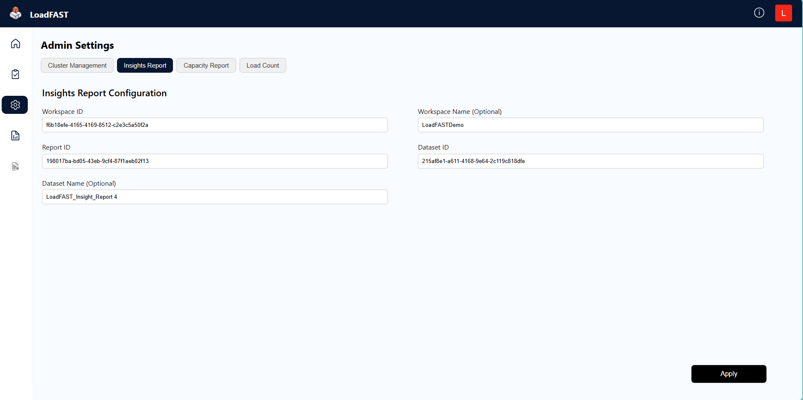<figcaption></figcaption></figure>

2. Obtain the required identifiers from Power BI service:&#x20;

* **Workspace ID**: Located in the URL after "groups/"

<figure>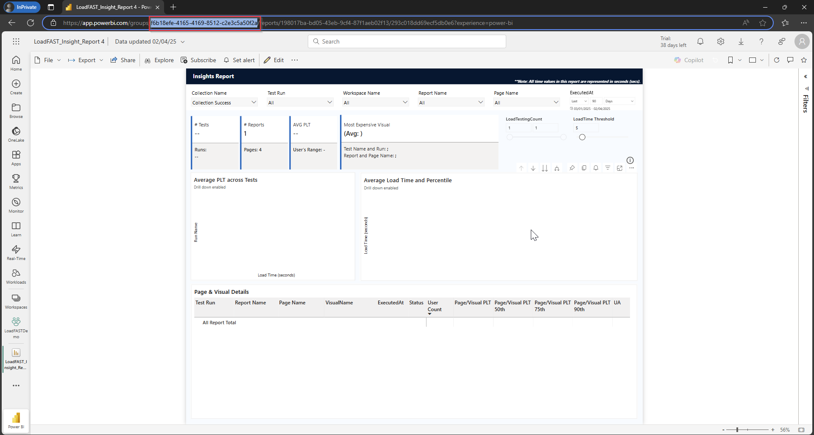<figcaption></figcaption></figure>

* **Report ID**: Located in the URL after "reports/"

<figure>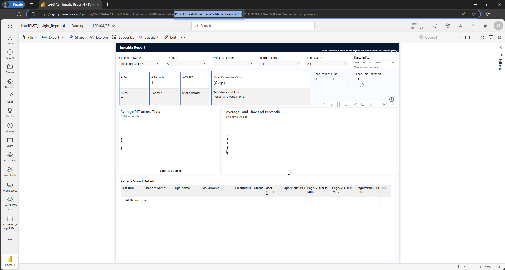<figcaption></figcaption></figure>

* **Dataset ID**: Access the semantic model used by the report and extract the ID from the URL after "datasets/"

<figure>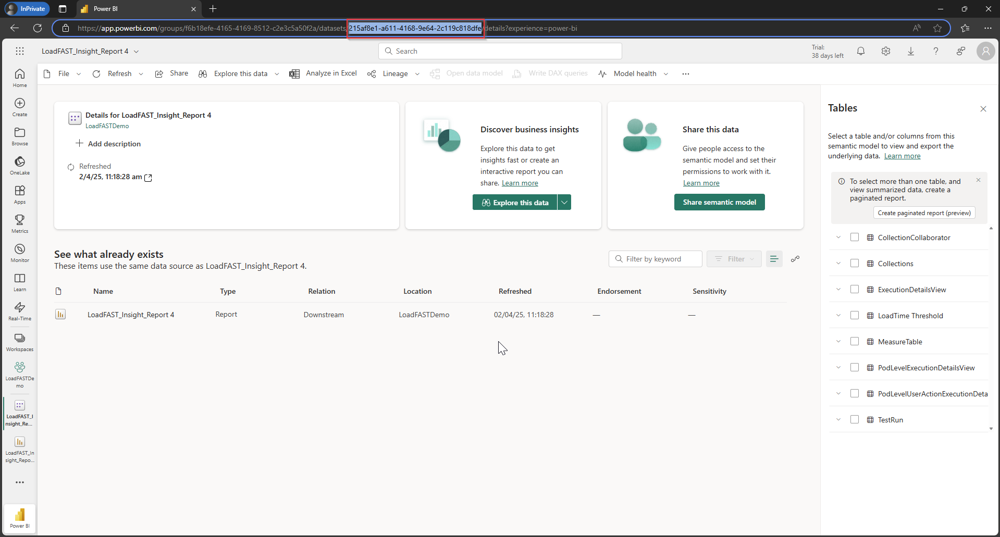<figcaption></figcaption></figure>

3. Enter these identifiers in their respective fields on the portal configuration page.
4. Click **Apply** to save your configuration.

<figure>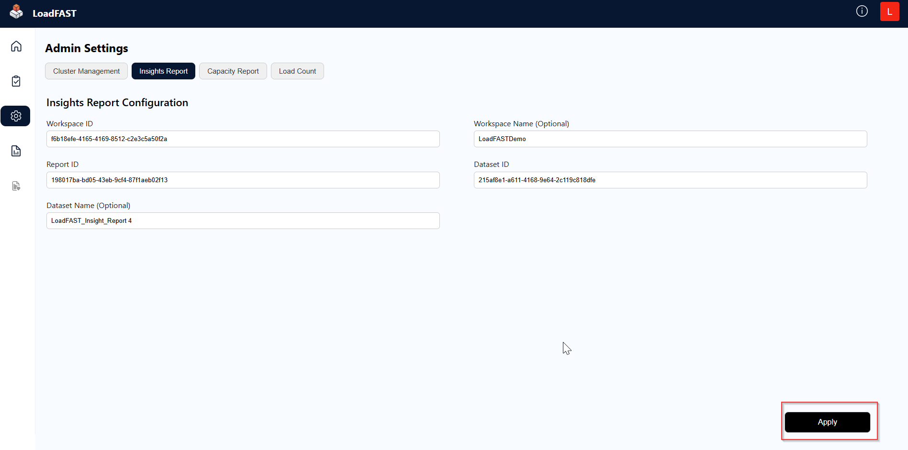<figcaption></figcaption></figure>

5. Access your report by clicking on **Insights Report** in the navigation menu.

<figure>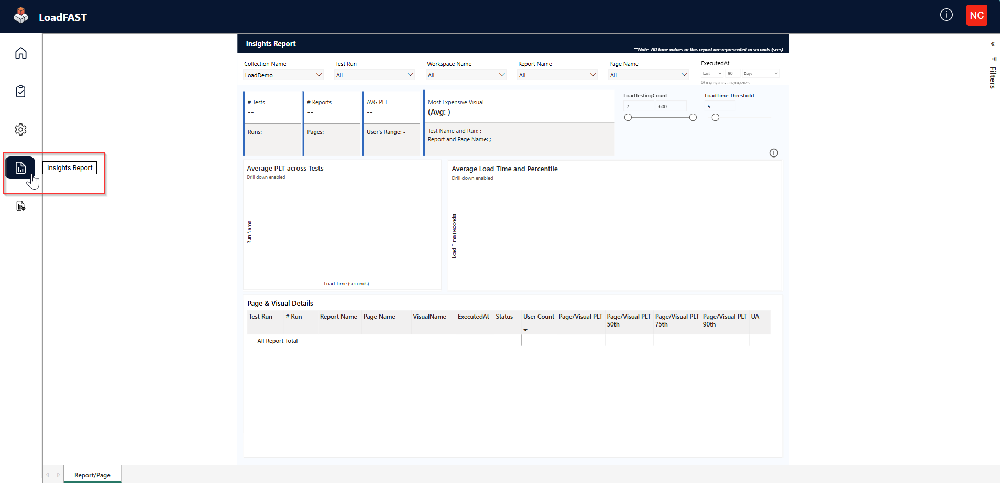<figcaption></figcaption></figure>

