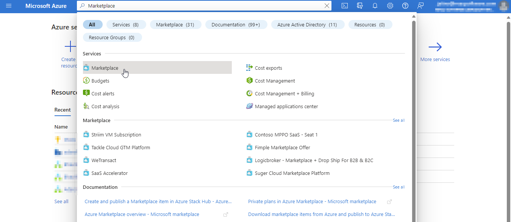
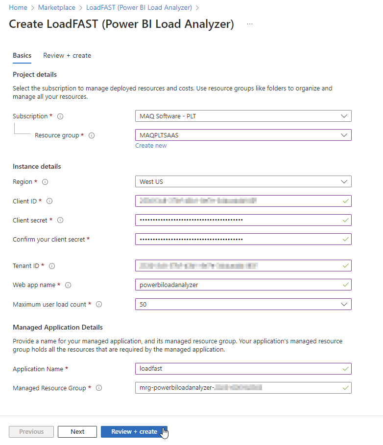
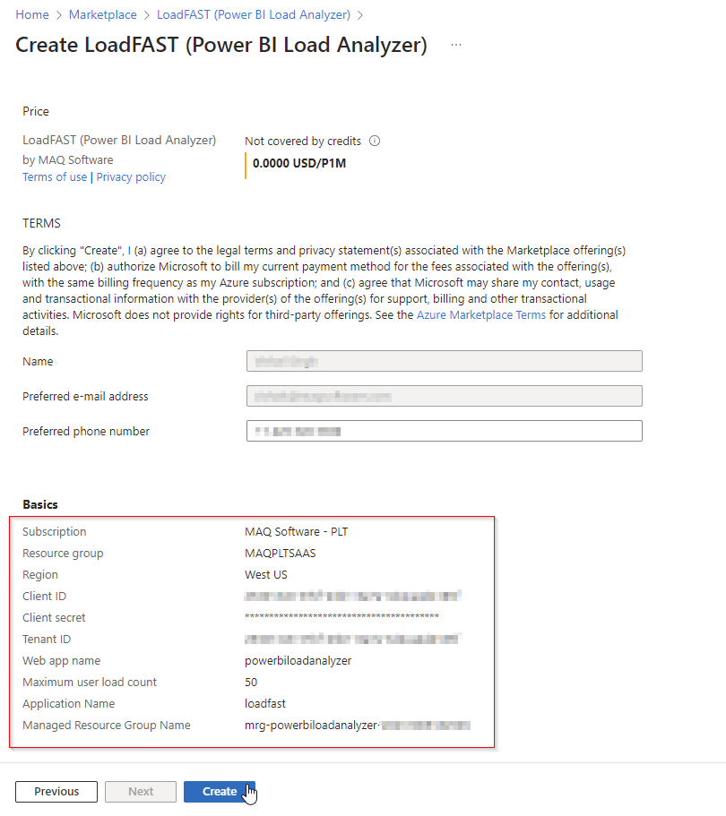
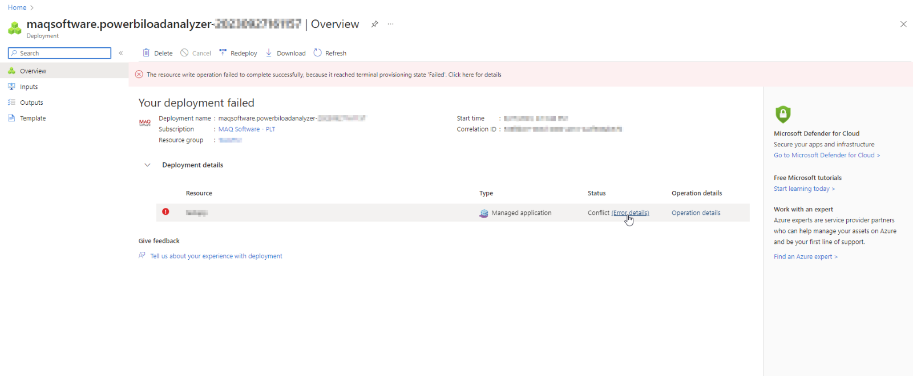
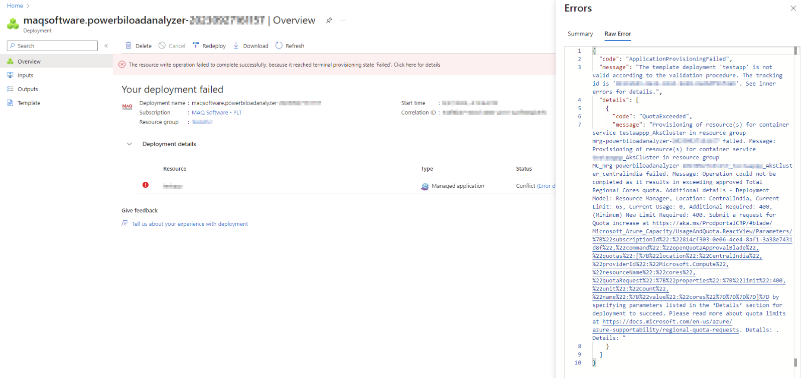
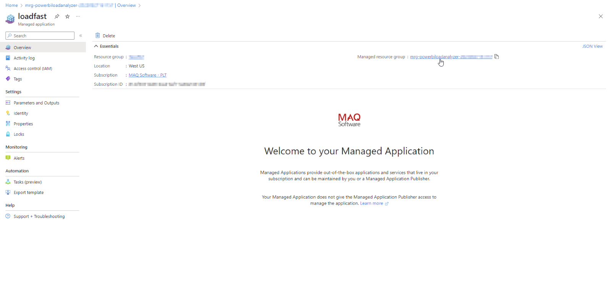

# Deploy automatically via Azure Marketplace

## Create a managed application

1.  Type "**Marketplace**" in the [Azure portal](https://portal.azure.com) search bar and select said option as it appears.&#x20;

    <figure><figcaption></figcaption></figure>


**Warning:** Azure Marketplace can be opened in 2 ways:\
\
Method 1 - Opening it as shown in step 1, which takes you here: .png>)

Method 2 - Opening it [directly](https://azuremarketplace.microsoft.com/en-us/marketplace/) (not from the Azure portal), which takes you here: .png>)

To follow the deployment steps detailed below, you need to access Azure Marketplace using Method 1. The steps below will **not** align if you use Method 2.


2. Search for "**LoadFAST**" and select the application from the search results.&#x20;

<figure><figcaption></figcaption></figure>

3.  Click **Create**.&#x20;

    <figure><figcaption></figcaption></figure>
4.  Fill the form as detailed below:

    <figure><figcaption></figcaption></figure>

    * Project details
      * Subscription: Select the subscription where the pre-deployment resources were created earlier. It should be the same one used in step 4 of the section detailing [Power BI capacities](https://maqsoftware.gitbook.io/pbi-load-analyzer-technical-documentation/setting-up/prerequisites/set-up-power-bi-and-azure#power-bi-capacity).
      * Resource group: Select a resource group (or create a new one by selecting **Create new**). It should be the same one used in step 4 of the section detailing [Power BI capacities](https://maqsoftware.gitbook.io/pbi-load-analyzer-technical-documentation/setting-up/prerequisites/set-up-power-bi-and-azure#power-bi-capacity).
    *   Instance details

        * Region: Select a region that has the subscription with the necessary Kubernetes regional cores quota. Steps to check/increase your subscription's quota were detailed in the [Prerequisites](https://maqsoftware.gitbook.io/pbi-load-analyzer-technical-documentation/setting-up/prerequisites/set-up-power-bi-and-azure#kubernetes-regional-cores-quota) section.
        * Client ID: Enter the application (client) ID of the service principal (app registration), generated when the [app registration](../prepare/pre-deployment/create-an-app-registration-for-the-loadfast-api.md#create-an-app-registration) was created. The application (client) ID was visible in step 7 of that process.
        * Client secret: Enter the client secret of the service principal (app registration), created [earlier ](../prepare/pre-deployment/create-an-app-registration-for-the-loadfast-api.md#create-a-client-secret)in the pre-deployment steps.
        * Confirm client secret: Re-enter the same client secret.
        * Tenant ID: Enter the directory (tenant) ID of the service principal (app registration), generated when the [app registration](../prepare/pre-deployment/create-an-app-registration-for-the-loadfast-api.md#create-an-app-registration) was created. The directory (tenant) ID was visible in step 7 of that process.
        * Web app name: Create and enter a name. This will be the name of the **web app** that is deployed when using the LoadFAST tool. This will be the URL of the tool: "https://<**app\_name>**.azurewebsites.net".
        * Maximum user load count: Select the value that was used in your [calculations](https://maqsoftware.gitbook.io/pbi-load-analyzer-technical-documentation/setting-up/prerequisites/set-up-power-bi-and-azure#kubernetes-regional-cores-quota) earlier (step 4 of that section).


**Warning:** The option selected for the maximum concurrent load count **CANNOT** be increased after deployment. If an increase is needed, the tool will have to be re-deployed and re-set up from the beginning.
 Take this into consideration as you select an option.
**Example**:

If 100 was selected as the maximum concurrent load count value but...

 * I only need 50 --> The load limit can be reduced directly within the tool.
* I need 150 --> The tool will have to be re-deployed.


* Managed Application Details
      * Application Name: Create and enter a name. This will be the name of the **managed application** where the Azure resources for the tool will reside.
      * Managed Resource Group: This field will be prepopulated when the form is opened. By default, the managed resource group name will be in this format: "mrg-powerbiloadanalyzer-**\<CurrentYearMonthDayHourMinuteSeconds>**", but you can change it to any name you want.
5. Click on **Next** to validate your inputs.
6.  Review and edit the details shown on the **Review + create** page as needed.&#x20;


**Note:** Note down the details in the **Basics** section as it will be required in upcoming deployment steps.


<figure><figcaption></figcaption></figure>

7. Select **Create** to initiate the deployment process and wait for it to complete.&#x20;
8.  Once deployment is complete, the following page will be shown. Select **Go to resource.**

    <figure><figcaption></figcaption></figure>


**Note:** If an error occurs or deployment fails, please try to resolve it by clicking on **Error details**. If it cannot be resolved, contact [our team](mailto:Sales@MAQSoftware.com) for additional assistance.

Error example: 

Error details page: 



9.  Note down the managed resource group name as it will be required in upcoming steps.&#x20;

    <figure><figcaption></figcaption></figure>
