# Create an app registration for the LoadFAST API

## Create an app registration&#x20;

To create an app registration, you must have one of the following Microsoft Entra roles:

* Global Administrator
* Cloud Application Administrator&#x20;


**Note:** A Global Administrator is typically the person who signs up for the Microsoft Entra ID tenant. View the guide on [assigning Microsoft Entra roles to users](https://learn.microsoft.com/en-us/azure/active-directory/roles/manage-roles-portal) for more information.


1. Log into the [Azure portal](https://portal.azure.com).&#x20;
2.  Type “**Microsoft Entra ID**" in the search bar and select said option as it appears.

    <figure>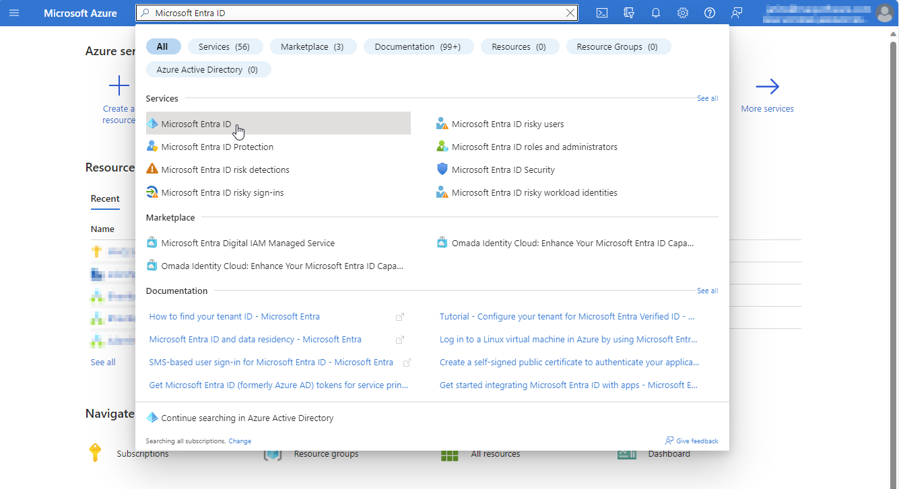<figcaption></figcaption></figure>
3.  Select **App registrations** (under Manage) from the left pane and click on **New registration**. This will take you to the **Register an application** page.&#x20;

    <figure>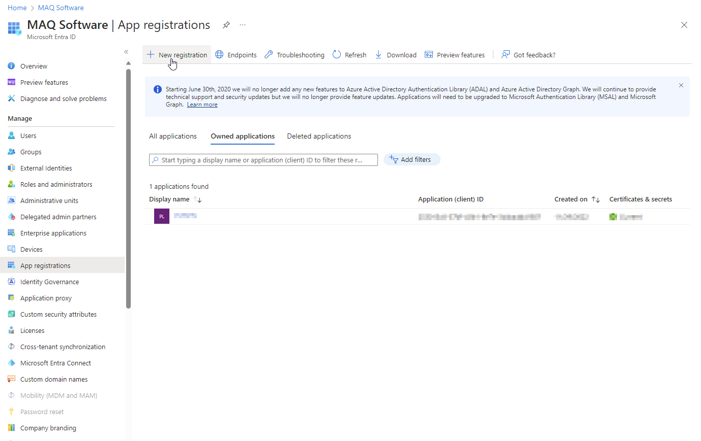<figcaption></figcaption></figure>

    <figure>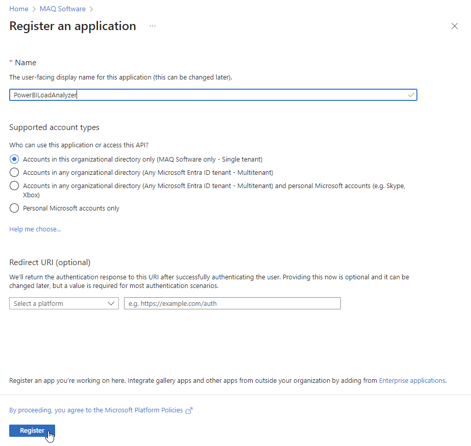<figcaption></figcaption></figure>
4. Enter an application name in the **Name** section. We have named it PowerBILoadAnalyzer, and will refer to it as such throughout the documentation.
5. Under the **Supported account types** section, select:
   * **Accounts in any organizational directory (------ only - Single tenant)** option (in our example, the "**------**" is MAQ Software, but this blank should have the name of your tenant instead).
6. Click on **Register** to create the application.
7.  After the app registration is created, you will see a summary page listing the details of your application.&#x20;


**Note:** Note down the display name, application (client) ID, and directory (tenant) ID. These details will be required as part of the set up process.


<figure>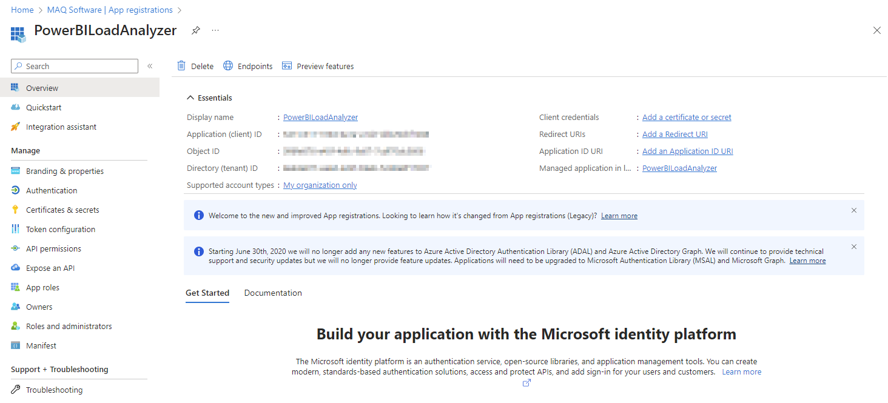<figcaption></figcaption></figure>

## Add Microsoft Graph API permissions

1.  Select **API permissions** from the left pane of the app registrations overview page.\

    <figure>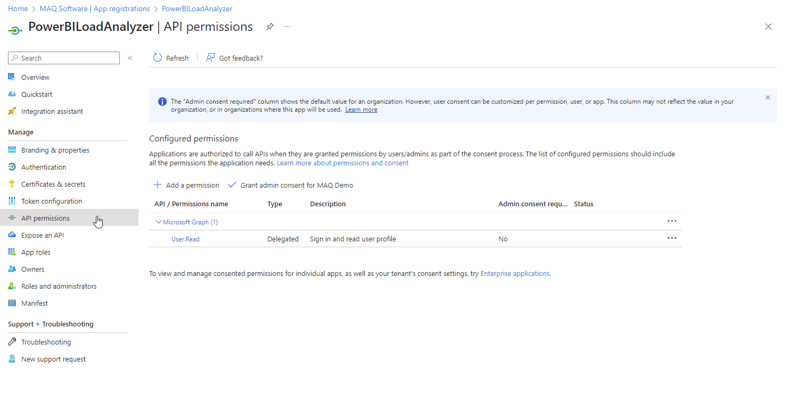<figcaption></figcaption></figure>
2. Click on **Add a permission** on the API Permissions page.
3.  A menu titled **Request API permissions** will appear on the right side.&#x20;

    <figure><figcaption></figcaption></figure>
4.  Click on **Microsoft Graph**.\

    <figure>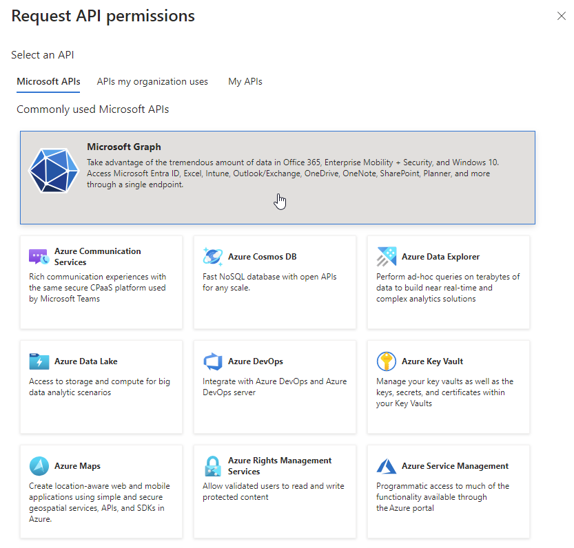<figcaption></figcaption></figure>
5.  Click on **Delegated permissions**.&#x20;

    <figure>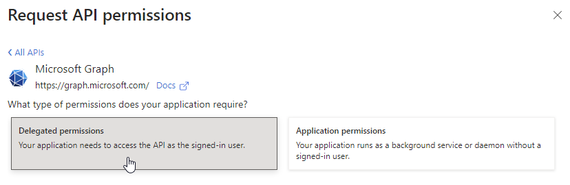<figcaption></figcaption></figure>
6. Scroll to the bottom to the **User** section and expand the drop-down menu.
7.  Select the **User.Read** and the **User.ReadBasic.All** permissions shown below:

    <figure><figcaption></figcaption></figure>
8. Click on **Add permissions** to confirm the changes.

## Add Power BI Service permissions

1.  Click on **Add a permission** on the API Permissions page to open the Request API Permissions menu.&#x20;

    <figure><figcaption></figcaption></figure>
2.  Select **Power BI Service**. You may need to scroll down on the menu to view this option.&#x20;

    <figure>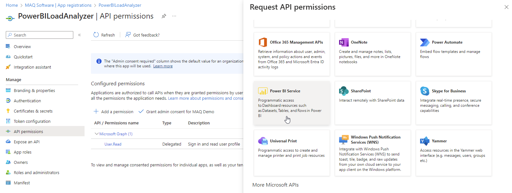<figcaption></figcaption></figure>
3.  Click on **Delegated permissions**.&#x20;

    <figure>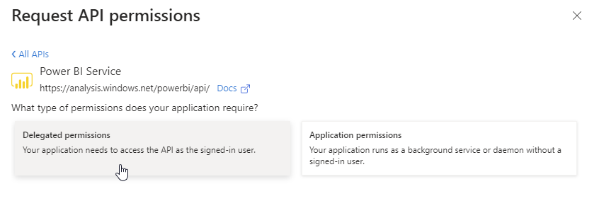<figcaption></figcaption></figure>
4. Scroll to the **Dataset**, **Report**, and **Workspace** section and expand their drop-down menus.
5.  Select the permissions detailed below:

    <figure>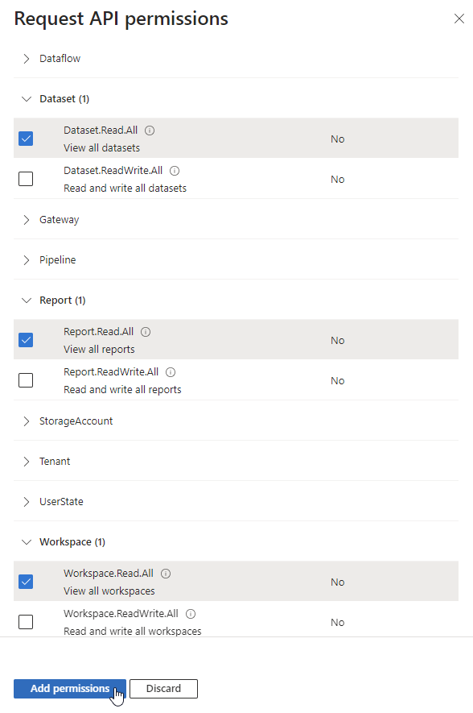<figcaption></figcaption></figure>

    * Dataset -> Dataset.Read.All
    * Report -> Report.Read.All
    * Workspace -> Workspace.Read.All
6. Click on **Add permissions** to confirm the changes.

## Create a client secret&#x20;

Create a client secret for the app registration created [earlier](https://maqsoftware.gitbook.io/pbi-load-analyzer-technical-documentation/setting-up/pre-deployment/create-an-app-registration-for-the-loadfast-api#create-an-app-registration) by following the steps detailed below:&#x20;


**Note: The client secret will only be visible at the time of creation.** Take note of it and store it securely for future use for whenever the client secret is required.


1.  Type “**App registrations**" in the [Azure portal](https://portal.azure.com) search bar and select said option as it appears.&#x20;

    <figure><figcaption></figcaption></figure>
2.  Click on **Owned applications** to see a list of applications you registered. Search for the application you created [earlier](https://maqsoftware.gitbook.io/pbi-load-analyzer-technical-documentation/setting-up/pre-deployment/create-an-app-registration-for-the-loadfast-api#create-an-app-registration).&#x20;

    <figure><figcaption></figcaption></figure>
3. Click on the application's name to access its details page.&#x20;
4. Select **Certificates & secrets** (under Manage) from the left pane.

<figure>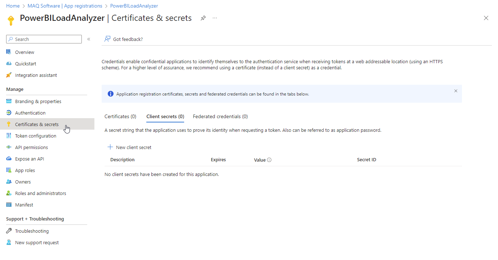<figcaption></figcaption></figure>

5. Click on **New client secret** to create a client secret.

<figure>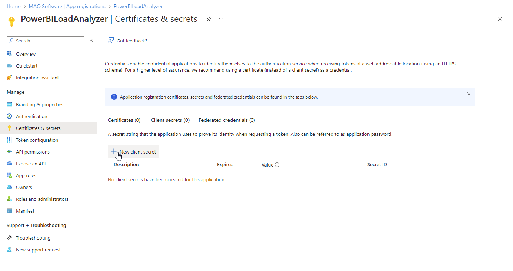<figcaption></figcaption></figure>

6. Enter a description and select when the secret expires. Click on **Add** to add the client secret.

<figure><figcaption></figcaption></figure>

7. Copy the value of the newly created client secret as shown below. **This value is required to deploy the tool.**

<figure>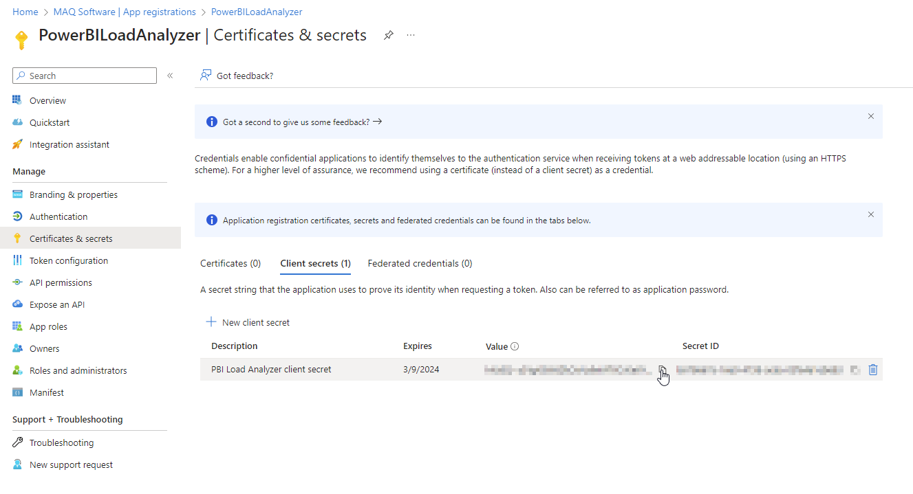<figcaption></figcaption></figure>


**Reminder:** Take note of the client secret and store it securely for deployment and future use for whenever it is required. The client secret is only visible at the time of creation and will **NOT** be visible again.

If the secret is lost another one will have to be created.


## Create an app role

1.  Select **App roles** from the left pane of the app registrations overview page.&#x20;

    <figure>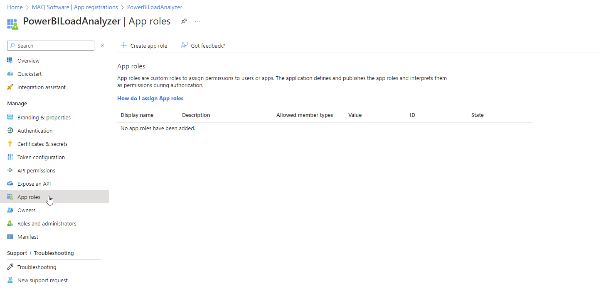<figcaption></figcaption></figure>
2.  Click on **Create app role**.\

    <figure>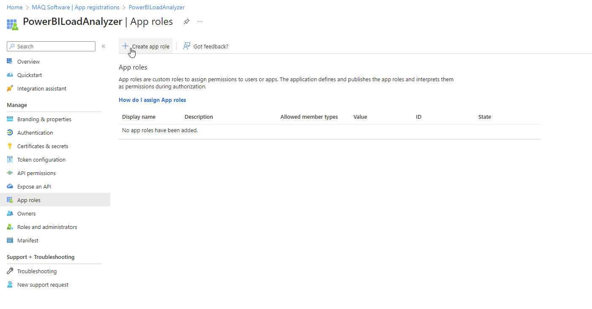<figcaption></figcaption></figure>
3.  Populate the fields and options as shown below and click on **Apply**.\

    <figure>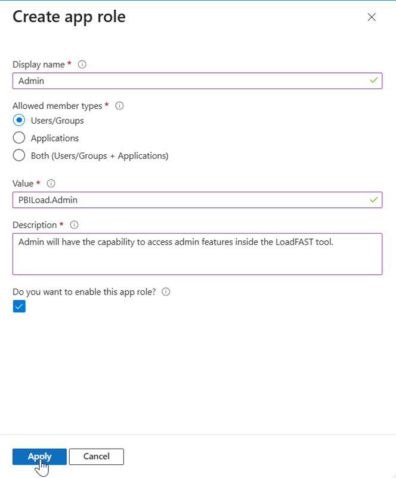<figcaption></figcaption></figure>

| **Field**            | **Input parameter**                                                       |
| -------------------- | ------------------------------------------------------------------------- |
| Display name         | Admin                                                                     |
| Allowed member types | Users/Groups                                                              |
| Value                | PBILoad.Admin                                                             |
| Description          | Admins will have the capability to access admin features inside the tool. |


**Note:** Ensure the value field is filled exactly as "**PBILoad.Admin**".

The admin feature of the tool will not work otherwise as the tool's code checks specifically for the "PBILoad.Admin" value. Without it, the user is unable to access the admin view of the tool.

