# Set up and configure the Power BI tenant settings

To create an app registration, you must have one of the following Microsoft Entra roles:

* Global Administrator
* Cloud Application Administrator


**Note:** A Global Administrator is typically the person who signs up for the Microsoft Entra ID tenant. View the guide on [assigning Microsoft Entra roles to users](https://learn.microsoft.com/en-us/azure/active-directory/roles/manage-roles-portal) for more information.


## Create a security group


**Note:** You can skip this step if you already have a security group.


1.  Type "**Microsoft Entra ID**" in the [Azure portal](https://portal.azure.com) search bar and select said option as it appears.\

    <figure><figcaption></figcaption></figure>
2.  Select **Groups** (under Manage) from the left pane.\

    <figure>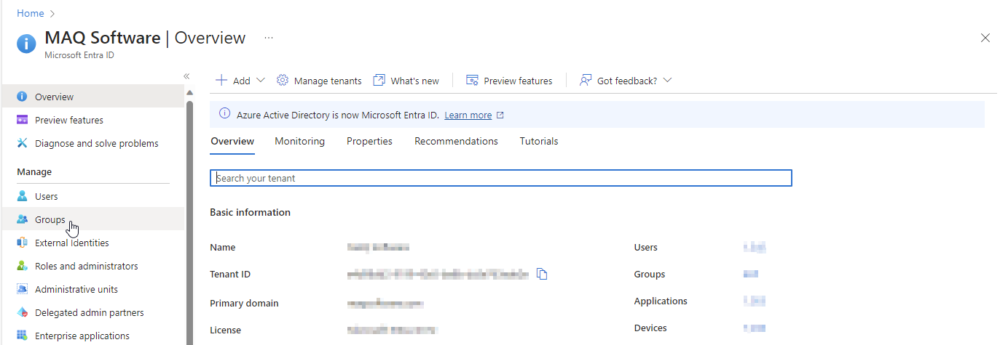<figcaption></figcaption></figure>
3.  Click on **New group** to create a new security group.\

    <figure>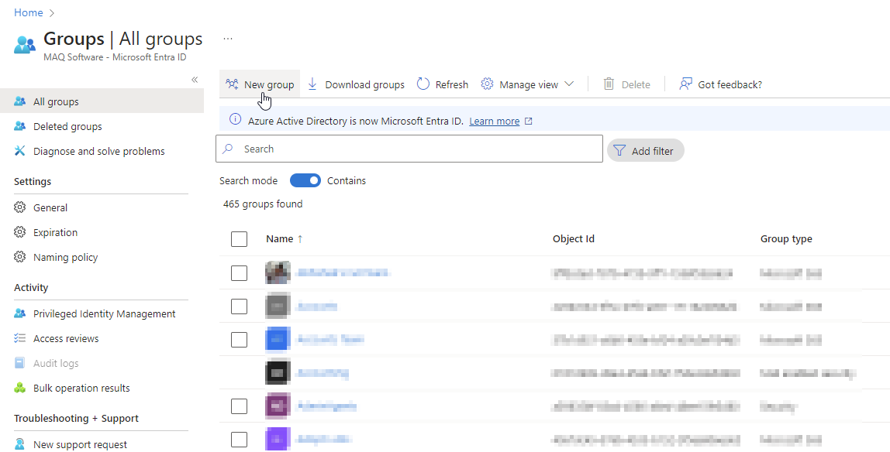<figcaption></figcaption></figure>
4.  Fill out the New Group form as detailed below: \

    <figure>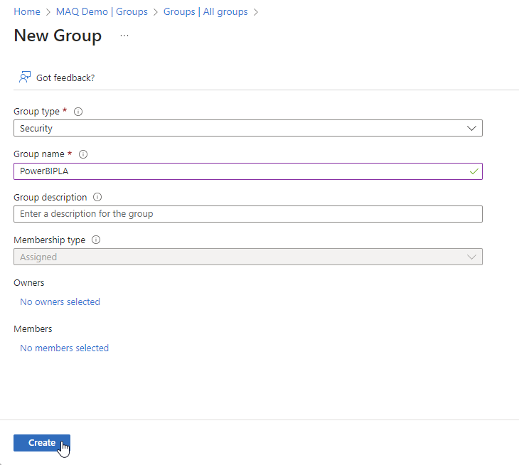<figcaption></figcaption></figure>

    * Group type: "**Security**"
    * Group name: Create a name for the group. In our example, we named the group PowerBIPLA, hence it will be referred to as such in this documentation's images, etc. Feel free to create your own group name.
    * Group description: Optional.
    * Membership type: Pre-selected, it should be "**Assigned**".
5. Click **Create** to create the security group.\

## Add the LoadFAST API App registration to the security group

1. Select **All groups** from the left pane of the Microsoft Entra ID page.
2. Type your security group's name in the search bar and click on it.&#x20;


**Note:** As mentioned in the previous section, we named our group PowerBIAPISG, hence it will be referred to as such in this documentation.


<figure>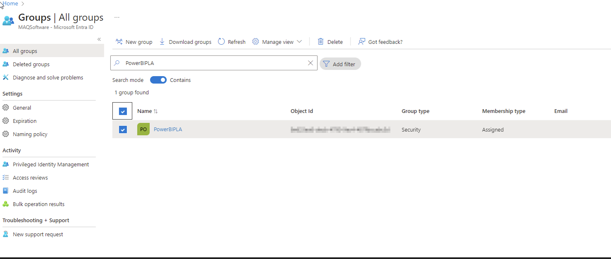<figcaption></figcaption></figure>

3.  Select **Members** (under Manage) from the left pane and click on **Add members**.

    <figure>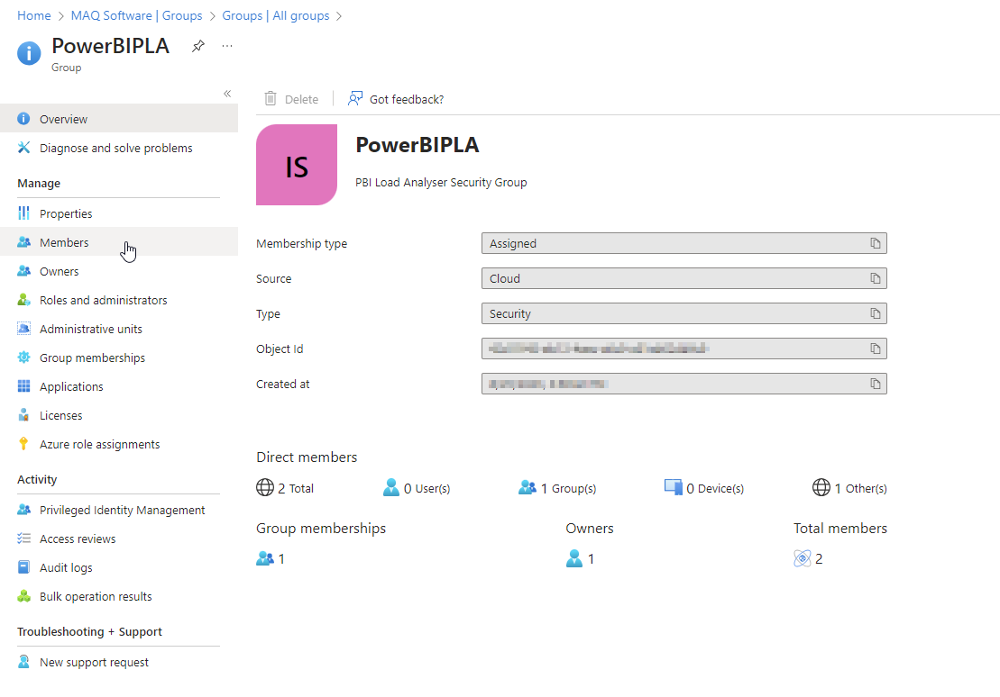<figcaption></figcaption></figure>
4.  Search for the name of the app registration created for the LoadFAST API also select the users to be running the PowerShell script for the tool and select it. Click on the **Select** button to add the app registration with Users to the security group.

    <figure><figcaption></figcaption></figure>

## Grant the app registration access on the Power BI workspace&#x20;

Granting the app registration (also known as the service principal) member-level access to a Power BI workspace is required to calculate the PLT for that workspace's reports.


**Note:** Repeat the following steps for **each** workspace where the LoadFAST will be used to calculate the PLT of that workspace's reports.


1. Go to the [Power BI web application/Power BI Service](https://app.powerbi.com/).
2.  Go to the workspace that you want to grant the tool access to.&#x20;

    <figure>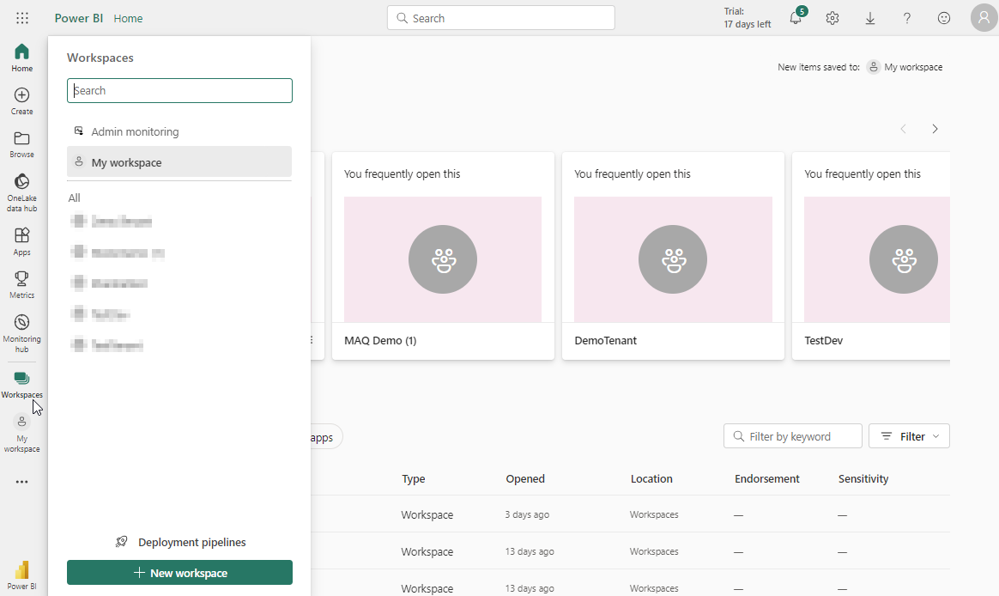<figcaption></figcaption></figure>
3.  Click on **Manage access** once on the workspace.&#x20;

    <figure>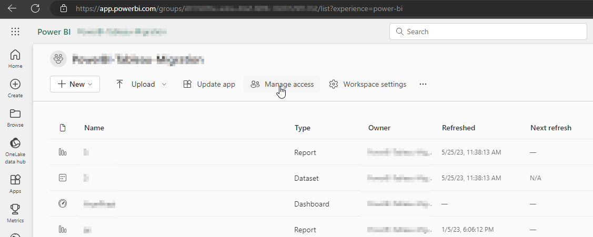<figcaption></figcaption></figure>
4.  Select **Add people or groups**.&#x20;

    <figure>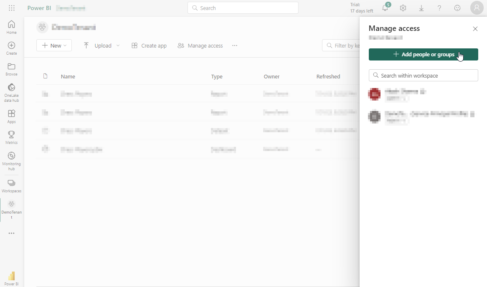<figcaption></figcaption></figure>
5.  Enter the name of the service principal (name of the app registration) which was created [previously](https://maqsoftware.gitbook.io/pbi-load-analyzer-technical-documentation/setting-up/pre-deployment/create-an-app-registration-for-the-loadfast-api#create-an-app-registration).

    <figure>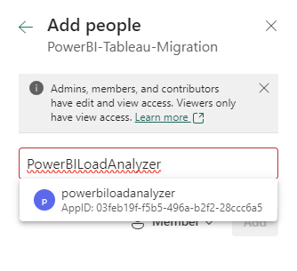<figcaption></figcaption></figure>
6.  Select the Member role as **Member**.&#x20;

    <figure>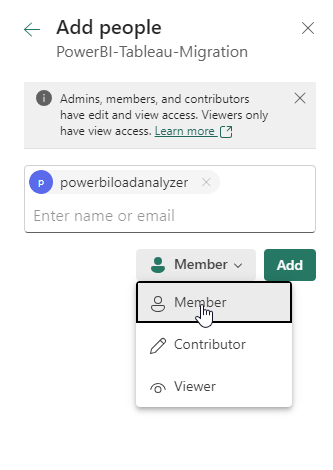<figcaption></figcaption></figure>
7.  Click **Add** to assign the role.

    <figure>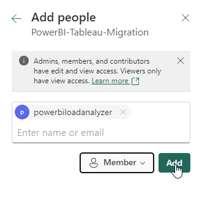<figcaption></figcaption></figure>
8. Repeat the above steps for all the workspace that you want to add or provide access to the service principal to calculate the Page Load Time for that workspace reports.

## Configure the tenant settings

1. Go to the [Power BI web application/Power BI Service](https://app.powerbi.com/).
2.  Click on the settings icon on the top right-hand corner and sign into the **Admin portal** using your Power BI administrator credentials (only an administrator account can access these settings).&#x20;


    **Note**: The Power BI service must be in the same tenant where you will deploy the LoadFAST tool.


<figure><figcaption></figcaption></figure>

3. Once you're on the **Tenant settings** page, modify the settings detailed below:

<figure><figcaption></figcaption></figure>


**Note:** Ensure that the LoadFAST API app registration was added to the security group as detailed in [this step](https://maqsoftware.gitbook.io/pbi-load-analyzer-technical-documentation/setting-up/pre-deployment/set-up-and-configure-the-power-bi-tenant-settings#add-the-loadfast-api-app-registration-to-the-security-group). This is needed to make sure the required access can be granted and the tool can work properly.


**Developer settings**

Scroll down within the Tenant settings page to find the **Developer settings**. These settings are required for the app registration created to use Power BI related APIs. Configure the setting as detailed below:

*   Expand the **Allow Service Principals to create and use profiles** setting. Enable the setting using the toggle.&#x20;

    <figure><figcaption></figcaption></figure>
* Under the **Apply to** section, add the previously created/your selected security group into the **Specific security groups** section. Click **Apply** to save the changes.&#x20;

## **Assign capacity to your Power BI workspace**


**Note:** Skip this step you are using a Premium workspace.


1. Go to the [Power BI web application/Power BI Service](https://app.powerbi.com/).
2.  Select **Workspaces** from the left-hand menu.&#x20;

    <figure><figcaption></figcaption></figure>
3.  Find the workspace you're using for embedding your content. Click on **...** next to the workspace's name and select **Workspace settings**.&#x20;

    <figure><figcaption></figcaption></figure>
4. Select the **Premium** tab and do the following:
   *   Under **License mode**, select the type of capacity you created [previously](https://maqsoftware.gitbook.io/pbi-load-analyzer-technical-documentation/setting-up/prerequisites/set-up-power-bi-and-azure#power-bi-capacity): Premium capacity or Embedded.&#x20;

       <figure><figcaption></figcaption></figure>
   *   Select the capacity previously created and select **Apply** to save the changes.&#x20;

       <figure><figcaption></figcaption></figure>
5.  After you assign your workspace to a capacity, a diamond appears next to it in the Workspaces list.&#x20;

    <figure><figcaption></figcaption></figure>

