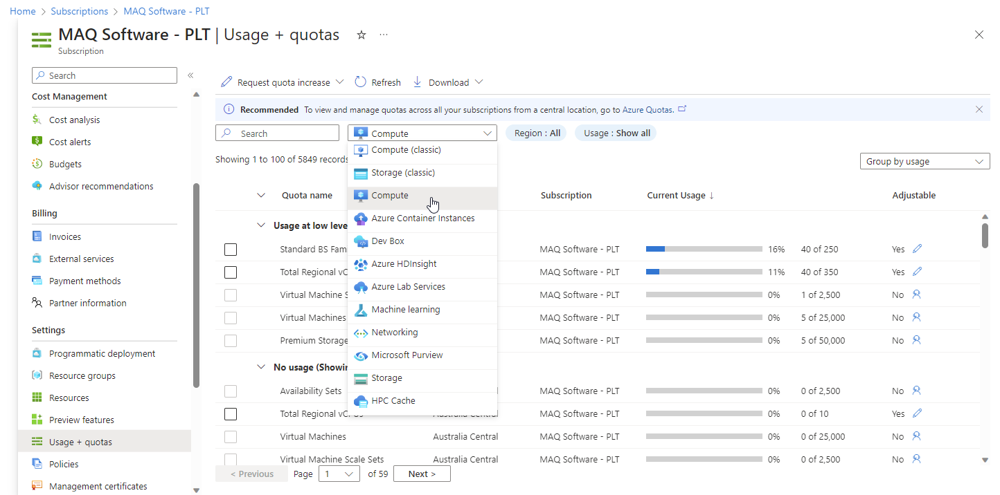
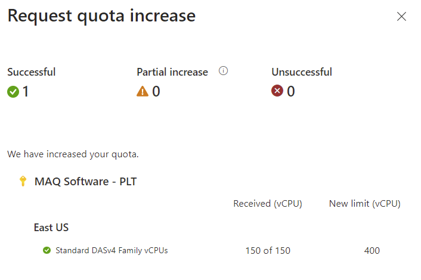

# Set up Power BI and Azure

## Power BI capacity

Ensure you have at least one embedded or premium Power BI capacity to use LoadFAST on. If one is not available, follow the steps detailed below to create a capacity:

1. Log into the [Azure portal](https://portal.azure.com).&#x20;
2.  Type “**Power BI Embedded**" in the search bar and select said option as it appears.&#x20;

    <figure><figcaption></figcaption></figure>
3.  Click on **Create**.&#x20;

    <figure><figcaption></figcaption></figure>
4.  Fill in the required information and then click on **Review + Create**.&#x20;

    <figure><figcaption></figcaption></figure>

    * PROJECT DETAILS
      * Subscription: Choose the same subscription that will be used to deploy the LoadFAST tool in Azure Marketplace.
      * Resource group: Choose a resource group. The resource group should be inside the same tenant/subscription that will be used to deploy the LoadFAST tool.
    * RESOURCE DETAILS
      * Resource name: Create and enter a name. This is the embed capacity name and will be used for the [Assign capacity to your Power BI workspace](https://maqsoftware.gitbook.io/pbi-load-analyzer-technical-documentation/setting-up/pre-deployment/set-up-and-configure-the-power-bi-tenant-settings#assign-capacity-to-your-power-bi-workspace) steps (in pre-deployment) and the steps following it.
      * Location: Choose a location.
      * Size: This is the Power BI embed capacity size. Select the resource size that best meets your needs.
      * Power BI capacity administrator: Enter the relevant user.

You must have the necessary CPU cores quota inside the subscription for the Kubernetes resource to be deployed successfully. Follow the steps below to check or assign the Kubernetes Regional Cores Quota:

1.  Type "**Subscriptions**" in the [Azure portal](https://portal.azure.com) search bar and select said option as it appears.

    <figure><figcaption></figcaption></figure>
2.  Select **Usage + quotas** (under Settings) from the left pane. Use the filter next to the search bar to ensure the grid is filtered to **Compute**. &#x20;

    <figure><figcaption></figcaption></figure>

    <figure><figcaption></figcaption></figure>
3.  Search for **Standard DASv4 Family vCPU**.&#x20;

    <figure><figcaption></figcaption></figure>
4.  Calculate the available cores needed (**maximum concurrent load count \* 2**). Aryan Updated


**Warning:** The option selected for the maximum concurrent load count value later in the [Deployment ](https://maqsoftware.gitbook.io/pbi-load-analyzer-technical-documentation/setting-up/deployment/deploy-automatically-via-azure-marketplace)section **CANNOT** be increased after deployment. If an increase is needed, the tool will have to be re-deployed and re-set up from the beginning.

Take this into consideration as you select an option.

**Example**:

If 100 was selected as the maximum concurrent load count value but...

* I only need 50 --> The load limit can be reduced directly within the tool.
* I need 150 --> The tool will have to be re-deployed.




**Note:** The maximum concurrent load count value is the largest number that you will enter under **Load testing count** in the tool. This is the highest number of simulated users you want to test using your Power BI reports/pages.

In the [Deployment ](https://maqsoftware.gitbook.io/pbi-load-analyzer-technical-documentation/setting-up/deployment/deploy-automatically-via-azure-marketplace)section, you will be asked to select your maximum concurrent load count from a list of **predetermined options**. To ensure the tool runs smoothly and quotas align, the maximum concurrent load count value used in the calculation here needs to be to one of the predetermined options:&#x20;

* 30
* 40
* 50
* 75
* 100
* 150
* 200

**Example:** If the maximum concurrent load count value needed is 175, we can either **round up** to 200 or **round down** to 150. We recommend rounding up for more flexibility but do what best suits your organization's resources.


5.  For the region where you want to deploy the LoadFAST tool in, check if the **Current usage** value meets the available cores needed value (e.g., in the image below, the **Current usage** value is 40 of 1,500). &#x20;


**Example:**&#x20;

Maximum concurrent load count = 200&#x20;

Available cores needed = **maximum concurrent load count \* 2** = 200 \* 2 = 400&#x20;

If the **Current usage** value is 50 of 500, it means 450 is available. Since we only need 400, this means that there are enough cores available.

<figure><figcaption></figcaption></figure>

6.  If your subscription does not have enough cores, then increase the core quota limit by clicking on the pencil icon under the **Adjustable** column.&#x20;

    <figure><figcaption></figcaption></figure>
7.  Enter the new limit required (400 is used as an example value in the image). Click on **Submit** and wait for the request to process.&#x20;

    <figure><figcaption></figcaption></figure>
8.  A pop-up page, as shown below, will appear once the request is successfully processed.&#x20;

    <figure><figcaption></figcaption></figure>

## Activate the Power BI Embedded Capacity

To work with Power BI APIs related to embedding feature, you need to activate the Embedded capacity.

1. Type “**Power BI Embedded**" in the [Azure portal](https://portal.azure.com/) search bar and select said option as it appears.
2.  Select the LoadFAST's embed capacity as shown below.

    <figure><figcaption></figcaption></figure>
3.  Click on the **Start**/play button.

    <figure><figcaption></figcaption></figure>
